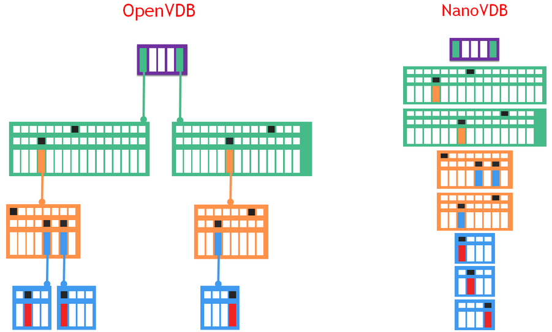

> 趁时间没发觉让我带着你离开 --- 《分裂》

## OpenVDB

OpenVDB 是一个获得奥斯卡奖的数据结构，在github上有对应的C++开源库，包含一个分层数据结构和一套工具，用于高效存储和操作在三维网格上离散化的稀疏体积数据。它由 DreamWorks Animation 开发，用于故事片制作中通常遇到的体积应用程序，现在由 Academy Software Foundation (ASWF) 维护，采用 MPL2.0 协议。


读者可以通过上面的视频对该数据结构有一个直观的了解，在整个视觉效果行业中，它被用于模拟和渲染水、火、烟、云和大量其他依赖于稀疏体积数据的效果。而这类数据通常的特点是全局稀疏而局部稠密（如下图）。而现实中这类数据也很常见，比如风场，污染等场数据。这类数据往往数据量比较大，且存在动态更新，空间分析等各类应用场景。因此，个人认为，OpenVDB可以作为场数据,甚至也是点云数据的一种存储格式，和现有的解决方案做一个对比。


OpenVDB格式的特点有：

- 动态，包括随时间的模拟和动画，以及拓扑结构的动态变换
- 内存高效，包括内存的动态和分层分配和数据的向量化压缩
- 泛型拓扑，支持任意动态拓扑结构
- 快速数据访问（随机或顺序）
- 没有范围限制，无限范围
- 高效的层级算法，基于B+树的缓存优化和bounding-volume查询，以及SSE，多线程，blocking等加速技术
- 自适应分辨率，树状结构
- 简易
- 可配置，比如树深度，节点大小等
- out of core，动态调度

另外，VDB的英文全称一直是个谜，比如‘voxel data base’，‘volumetric data block’,'volumetric dynamic B+tree'。所以，我们也没必要纠结这个名字的本意了，感兴趣的可以看一下奥斯卡给这个数据格式颁奖的视频梗，女主持忍不住说："I don't know why it sounds so sexual to me"。然后忍不住的笑了整场，搞得场下的理工男一脸懵逼。

## 基本概念


如上图，是驯龙高手中的一份数据，左侧可见，存在大量的冗余体素，而Active的体素网格是长7897宽1504高5774，采用VDB格式的大小是1GB，而对应的体素数据则需要$\frac{1}{4}$TB。可以看到，体素的精度从绿色（左），到橙色（中），再到蓝色（右），采用了自适应的树状结构，逐步变得稠密。


OpenVDB的数据结构是一种B+ Tree的变体，NTFS和Oracle中也采用了该格式，在大数据量下具有较好的性能。上图是VDB的1D示意图，在这个树状结构中，Root（灰色文字）是稀疏的，大小可调节。而其他节点（绿色，橙色和蓝色文字）则是稠密的，且长度是2的N次方。节点上对应的数组（竖长的大方块）分别是```mRootMap```，```mInternalDAT```，```mLeafDAT```，分别保存了指向子节点的指针（绿色，橙色，蓝色），上层切片的值（白色，灰色）或者体素的值（叶子节点中的灰色和红色）。其中，灰色表明该节点术语不活跃状态，最下面的白色节点则是压缩后的叶子节点，去除灰色节点。而DAT（direct access table）上面的扁平的小方块是压缩后的bit mask，用来记录局部的拓扑结构。


上图对应的是一个圆的2D结构，可以看到bit-mask如何记录节点间的拓扑结构。通常，在OpenVDB上，会保存density属性，还有一个可选的temperature属性，每个voxel存储的是signed distance field（SDF），标识inside或outside的距离。如下是离散形式下的计算过程，根据曲线获取临近四个点的distance value，通过插值方式计算voxel内任意点$(x,y)$的distance值。


- 分辨率和分支因子/树的深度成正比
- 通常树越小，随机访问的性能越高
- 自适应能力更适合分支因子小且深度大的树
- 内存和节点的个数，大小成正比
- 缓存命中率更喜欢节点小，深度大的数

数据存储后，下一步就是读取操作，而存储和读取之间存在天然的矛盾，理想中，我们希望时间都花费在计算而不是查询中，而现实中，特别是稀疏数据下，如何优化查询时间是一个问题，如何控制边界，如何保持拓扑关系，内存关联，以及调度的平衡等，而 OpenVDB 中也总结了如上的几点，并针对三种访问形式进行了优化：

- Random Access：基于Hash map，采用CPU Cache的策略（缓存已经访问过的节点）
- Sequential Access：利用```mChildMask```和```mValueMask```空间locality能力，基于DeBruijn
- Stencil Access：建立全局坐标下的offset，通过iterator和Accessors的方式实现```setValue```和```getValue```

在具体的应用算法上，OpenVDB支持一些拓扑运算，偏微分计算，CSG建模，布尔运算，填充算法以及Ray Marching的优化。如下是三个个人认为比较有代表性的应用案例。


## PBRT V4

2020年Matt Pharr在HPG上的演讲还恍如昨日，介绍了[PBRT V4](https://github.com/mmp/pbrt-v4 "pbrt, Version 4")从V3升级的的技术实现，里面很多的经验都很有价值。而V4中采用了新的体渲染的算法，引入了```Null Scattering```的概念，而且对Heterogeneous的数据，采用了```NanoVDB```格式。```NanoVDB```是一个迷你版的```OpenVDB```，其最大的特点是同时支持CPU和**GPU**下的高分辨率稀疏体积数据的渲染，包括：C++，C99，CUDA，OpenCL，OpenGL，WebGL，DirectX12，OptiX，HLSL和GLSL，且不依赖OpenVDB，并可以和OpenVDB相互转换。



在数据结构上，```NanoVDB```是对```OpenVDB```的线性快照，节点严格的4字节对齐，广度优先，如上图，同一个level的节点都紧凑的存储在一起而抛弃了指针（链表），因此在不同设备（CPU与GPU）之间的拷贝性能更快，且对缓存更为友好。并且，支持元数据的统计能力，以及 out-of-core 和 in-core 的数据压缩支持。而```NanoVDB```最大的局限是无法修改数据的拓扑结构。此外，个人很好奇WebGL上如何支持NanoVDB，搜了一下没有相关信息，所以不确定它是如何宣称支持的。

在PBRT V4中，依赖[openvdb](https://github.com/AcademySoftwareFoundation/openvdb "openvdb")实现对NanoVDB数据格式的解析。针对NanoVDB数据格式，封装了```NanoVDBMediumProvider::Create```读取该数据文件，该对象中通过```densityGrid```记录数据内容，```bounds```记录数据范围。

```C++
// media.h
 const nanovdb::FloatGrid densityFloatGrid = densityGrid.grid<float>();

  __hostdev__ Vec3T worldToIndexF(const Vec3T& xyz) const;
```
如上图，```densityGrid```通过```FloatGrid```对象实现范围值到索引值的转换，里面的```__hostdev__```说明该方法支持CPU和GPU两种形式。有了该索引值后，```NanoVDB```提供了两种方式获取该索引的内容：

```C++
// 基于Accessor,Stencil Access 
 auto accessor = densityFloatGrid->getAccessor();
float density = accessor.getValue({nx, ny, nz});

// 基于Random Access：Bottom-up或Top down
using Sampler = nanovdb::SampleFromVoxels<nanovdb::FloatGrid::TreeType, 1, false>;
float density = Sampler(densityFloatGrid->tree())(pIndex);
```
这样，PBRT V4支持了丰富的OpenVDB的体数据，而自身提供了Bunny Cloud，Disney Cloud，Explosion均是NanoVDB格式。下图时PBRT渲染Explosion的效果


## 总结

本文是学习PBRT V4读取OpenVDB时的总结，包括OpenVDB，NanoVDB的概念和特点，OpenVDB的数据结构，读取优化以及主要的应用，最后是通过PBRT V4源码，了解openvdb开源库中读取文件，访问数据对应的API。