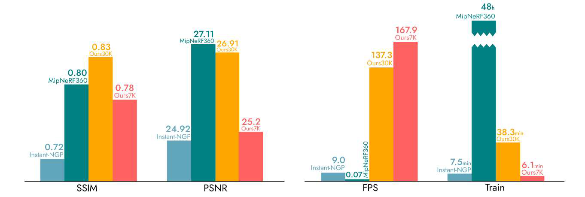

3D Gaussian Splatting（3DGS）是一种表达3D场景并渲染的方式，该技术源于2023年的论文‘3D Gaussian Splatting for Real-Time Radiance Field Rendering’，可以看作是Nerf的一种（更优的）替代方案, 如上视频是官方提供的自行车Demo。

通常，数据采集的结果是点云数据，然后是三维重建，将点云构建为三角形的Mesh，最后是三角网结构的（实时）渲染。Point-Based Computer Graphics（PBCG）的目标就是直接渲染点，节省掉三维重建过程。

3DGS可以看作是Nerf与PBCG的互补。不同的是Nerf是（稠密的）Voxel-based Neural rendering，而3DGS是（稀疏的）Point-based Neural rendering。而这种数据稀疏的优化，则可以大大的缩小训练和渲染的时间，而neural的在其中保证了“有损压缩”的质量。

为了实现这一效果，3DGS主要贡献有三点：

- 3D Gaussian的数据结构（representation）
- 基于3D高斯球的实时渲染（rendering）
- 3D Gaussian的数据优化（training）

## 3D Gaussian

## Rendering

## Training

https://lfranke.github.io/trips/

https://repo-sam.inria.fr/fungraph/3d-gaussian-splatting/