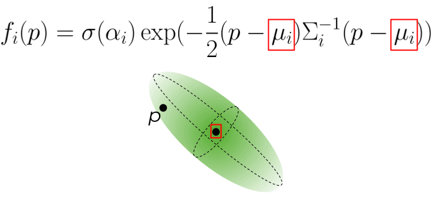

3D Gaussian Splatting（3DGS）是一种表达3D场景并渲染的方式，该技术源于2023年的论文‘3D Gaussian Splatting for Real-Time Radiance Field Rendering’，可以看作是Nerf的一种（更优的）替代方案, 如上视频是官方提供的自行车Demo。

通常，数据采集的结果是点云数据，然后是三维重建，将点云构建为三角形的Mesh，最后是三角网结构的（实时）渲染。Point-Based Computer Graphics（PBCG）的目标就是直接渲染点，节省掉三维重建过程。

3DGS可以看作是Nerf与PBCG的融合，将Nerf中（稠密的）Voxel改造为（稀疏的）Point。数据稀疏化可以大大的缩小训练和渲染的时间，而neural则保证了该“有损压缩”的（渲染）质量。

为了实现这一效果，3DGS主要有三点贡献：

1. 3D Gaussian的数据结构（representation）
2. 基于3D高斯球的实时渲染（rendering）
3. 3D Gaussian的数据优化（training）

## 3D Gaussian

3D Gaussian的属性包括位置$(x,y,z)$，对一个三维球进行拉伸$M_{scale}$和旋转$M_{rotation}$时，则为一个（anisotropic）椭球，对应一个协方差矩阵$\Sigma$，不透明度$\alpha$以及颜色$C$，为了让该颜色跟相机视角（view direction）相关，后续用一个球谐函数来表达$C$。这样，函数$f_i(p)$表达高斯（椭）球中任意一点的不透明度，对应体渲染中的透过率$T$。

## Rendering

3DGS采用了Gaussian Splatting的渲染方式，主要包括三步（如下图所示）：

- 3D Gaussian投影为屏幕空间下的2D Gaussian
- GPU下进行深度排序
- 根据深度对每个像素的2D高斯进行$\alpha$-blending

首先，3D空间投影到屏幕对应一个投影矩阵$W$，该矩阵对像素$i$的$(x,y)$求导可得Jacobian $J$，表示换元过程中的形变。这时，近似的2D椭圆对应的协方差矩阵为：

$$
\Sigma ^{2D}=JW\Sigma W^TJ^T
$$

用$\Sigma ^{2D}$替换$f_i(p)$中的$\Sigma$，我们可得2D空间下的表达式$f_i^{2D}(p)$

投影后则是基于深度的排序，然后混合与该像素$i$重叠的$N$个有序高斯球获取该像素的颜色，渲染公式如下：

$$
C\left( p \right) =\sum_{i\in N}{c_i{f_i}^{2D}\left( p \right) \mathop {\underbrace{\prod_{j=1}^{i-1}{\left( 1-{f_j}^{2D}\left( p \right) \right)}}} \limits_{T}}
$$

论文中采用了GPU排序算法，另外提供了一种tile-based分块渲染，两者都是为了优化渲染的性能，实际中，WebGL的3DGS并没有采用分块渲染，而排序则是在Workers线程中实现。

## Training

渲染是可微的，因此，我们可以对比渲染后的图片和Ground Truth，来训练优化3D 高斯数据的分布，对应一个自适应稠密化的优化，分别对应过小（Clone）和过大（Split）两个策略。

## Optimization

基于如上的内容，论文中总结了如下几个优化策略

- SfM点云（相比视频效果更好）
- SH实现view-dependant color
- densification

## Trilinear

另外，一个Gaussian只支持一个颜色，一个问题是如何支持纹理（插值），该论文‘TRIPS: Trilinear Point Splatting for Real-Time Radiance Field
Rendering’实现了对其的改进。

该方法不是直接渲染到屏幕，而是先根据LOD渲染到纹理（mipmap）中，然后迭代对MipMap做一个（Gated）卷积，通过SH获取颜色，Tone mapping获取像素值。训练时间比3DGS要久，但渲染时间相当（稍慢）。

## 总结

（个人观点，应该也是正确观点）无论是Nerf还是3DGS，更侧重3D重建而非渲染。

祝我好运。
