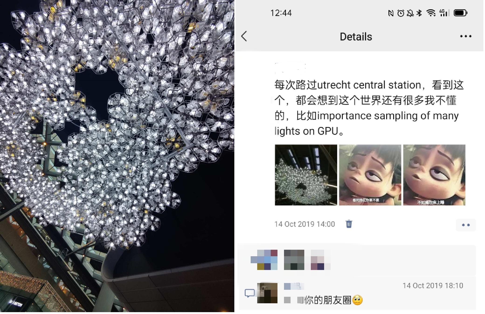

## 简介

Resevoir-based Spatiotemporal Importance Resampling (ReSTIR，发音 rest儿), 是一种通过像素之间共享来重用样本的方法，可以理解为渲染阶段的降噪技术，两者都假设相邻像素之间具有相似性，降噪技术则采用平滑，副作用是有偏（biased），而ReSTIR采用重复采样，可以做到无偏（unbiased）。

在Ray tracing仍然相对昂贵的现实下，ReSTIR技术一方面允许渲染方程在不同积分甚至不同积分域之间的重采样，一方面又采用Unbiased contribution weight来代替传统的PDF，做到更好的拟合，近似和采样分布。从而达到了每帧只需要很少的射线而快速收敛（无偏or有偏），带来百倍到万倍的采样效率提升。这些优势让其成为ray tracing实时渲染中不可或缺的技术，自第一篇论文'Spatiotemporal reservoir resampling for real-time ray tracing with dynamic direct lighting'。在2020年发表后， 该技术得到快速发展，且在诸多产品中得到应用。

## RIS

介绍Resampled Importance Sampling (RIS)之前，我们需要简要的提一下Importance Sampling （IS）。

$$
I = \int_{\Omega}f(x) \mathrm{d}x \approx \left< I \right> = \frac{1}{M} \sum_i^M \frac{f(X_i)}{p(X_i)},
$$

这里，$\left< I \right>$对$I$的一个无偏一致的估计，$p$是 probability density function (PDF), 满足$\int_{\Omega} p = 1$，$X_i$是随机神生成的样本，随着样本数$M$的增大，该预估会收敛为$I$。这样，一个复杂积分则可以通过MC来求解，而PDF则会影响采样的方差V,进而影响所需的样本个数$M$：

$$
\left< I \right> =\begin{cases}
	\left| \Omega \right|{\color{blue} \frac{1}{M}\sum_i^M{f\left( X_i \right)}}&		p\left( X_i \right) =\frac{1}{\left| \Omega \right|}\\
	\frac{f\left( X_i \right)}{p\left( X_i \right)}&		p\left( X_i \right) =If\left( X_i \right)\\
\end{cases},
$$

这里，如果PDF采用uniform distribution，橙色是求一个平均值，然后乘以积分域，从而获得$\left< I \right>$，可想而知，$M$越大，$\left< I \right>$值越准确。而假设我们有一个完美的PDF，则仅需要一次采样，便可以获取正确值。

相比IS， RIS的采样方式如下：

- 根据$p$生成$M$个样本$(X_1,...,X_M)$
- 样本$X_i$有一个重采样权重$\omega_i=m_i(X_i)\hat{p}(X_i)W_{X_i}$
- 从$M$个样本中根据$\omega_i$成比例选取样本$X$
- 计算样本$X$的$W_X$，获取$\left< I \right> = f(X)W_X$

这里，$m_i$是MIS权重，假设样本分布均已，$m_i=\frac{1}{M}$，$\hat{p}$为目标函数，可以是unnormalized function，我们采用$\hat{p}(X) \approx f(x)$, $W_{X_i}=\frac{1}{p(X_i)}$是该样本的贡献权重
，$W_X=\frac{1}{\hat{p}(X)}\sum_{j=1}^M\omega_i$则是选中样本$X$的权重。最终，RIS可得：

$$
\left< I \right> = f(X)W_X = f(X)\frac{1}{\hat{p}(X)}\sum_{j=1}^M\omega_i
$$

$$
=\sum_{j=1}^M\omega_i=\frac{1}{M}\sum_{j=1}^M\frac{f\left( X_i \right)}{p\left( X_i \right)}
$$

RIS仅需要一个样本$X$，通过基于权重的随机选择而改进$W_X$,就可以得到和IS一致的结果。某种意义上，RIS类似Path guiding技术，将所有样本累计成一个样本和一个更好的PDF值。这里，$W_X$虽然是选中样本$X$对应的权重，但其参数需要之前的所有样本，并不仅仅是X的一个函数。

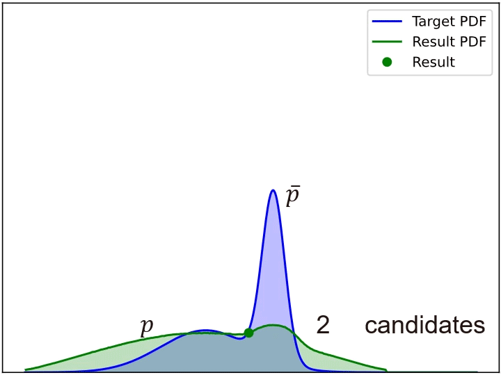

现在，我们可以在ray tracing中采用RIS，我们将生成$M$个候选而不是单个样本，给每个样本一个权重然后根据权重随机选择其中一个。最后，我们计算它的贡献权重。

## WRS

RIS算法需要生成$M$个样本，因此空间复杂度是$O(M)$，这对GPU是不友好的。而weighted reservoir sampling 可以从样本流中抽取样本，而无需预先了解有多少样本即将到来，并且保证被选中的样本权重不变：

$$
Pr\left[ choose\,\,i \right] \,\,=\begin{cases}
	\frac{w_{m+1}}{\sum_{j=1}^{m+1}{w_j}}&		i=m+1\\
	\frac{w_i}{\sum_{j=1}^m{w_j}}\left( 1-\frac{w_{m+1}}{\sum_{j=1}^{m+1}{w_j}} \right)&		i\ne m+1\\
\end{cases},
$$

基于如上算法实现了Streaming RIS的能力，最终实现如下的渲染效果。

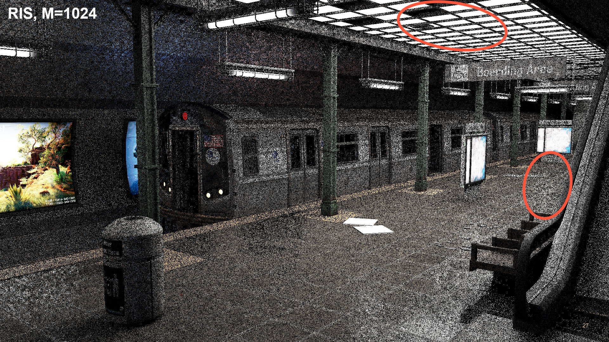

## RIS with MIS

地面红圈部分暴露了一个问题，对于glossy的部分，因为是之前的采样策略是从光源采样，而没有考虑BSDF采样策略。这样，我们则有了两种采样策略$area$和$brdf$。

之前我们$m_i=\frac{1}{M}$。这里默认多个采样策略有着相同的分布，或者至少分布的域（support）相同（正确，但可能会有奇异值的过大过小，导致方差过大）。如果不同的采样策略所覆盖的集合不同时，则算法有偏。因此，通常我们需要采用Balance Heuristic:

$$
m_{area}\left( x \right) =\frac{p_{area}(x)}{M_{area}\cdot p_{area}(x)+M_{brdf}\cdot p_{brdf}(x)}
$$

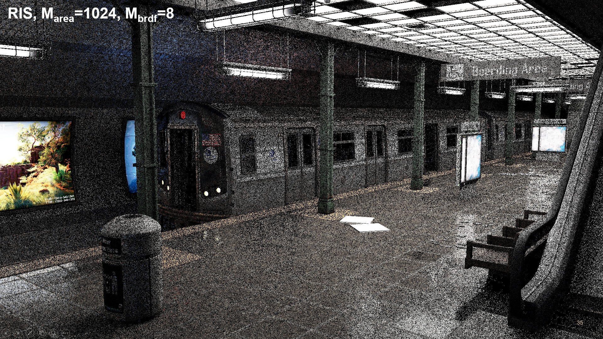

对应的伪代码如下，我们构建一个Reservoir类，针对每一个像素，生成样本，然后再渲染该像素。每个像素仅需要保存一个Reservoir对象，这里，在计算$\hat{p}(X)\approx f(x) = BSDF(X)\cdot L_e\left( X \right) \cdot G\left( X \right) \cdot {\color{blue} V\left( x_1\leftrightarrow x_2 \right) }$时，我们会取消对V函数的计算。在GPU中，主要有generateSample和shadePixel两个pass。

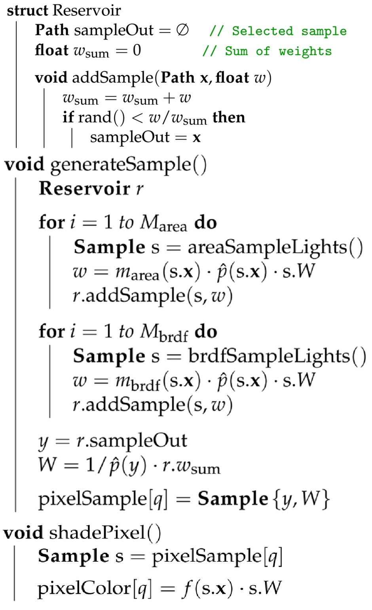

## ReSTIR for DI

我们现在提供了一种具备streaming Importance Resampling能力的ray tracing算法，和常用的NEE算法性能相当，这里主要是依靠的Re(servoir)和IR（RIS），下面，该算法开始尝试在Spatial和Temporal两个方面，来探索如何低成本的复用样本，类似后处理的降噪，两者假设周边像素具有相似性，且不需要处理场景中每个像素的许多灯光。只需要处理随机选择的一小部分灯光，并且从这个子集中只选择一个作为“最重要的”贡献。

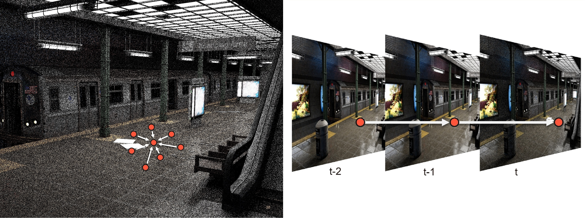

在当前点屏幕空间，每个像素$i$都有一个Reservoir对象$q_i$，通过G-Buffer，我们找到该像素在上一帧相同空间位置的Reservoir对象$q_i^\prime$，然后在像素$i$为圆心，半径$r$（像素单位）的disk内随机找$k$个像素，每个像素$k$对应一个Reservoir对象$q_k$。我们重新计算该样本$r^\prime$针对当前像素$i$下对应的PDF $\hat{p}_i(r^\prime_y)$，则该样本的权重$w_{r^\prime} = \hat{p}_i(r^\prime_y) \cdot r^\prime.W \cdot r^\prime.M$。然后用{$r^\prime_y, w_{r^\prime}$}作为样本参到采样更新中。

最后一个优化是针对visibility，刚才提到，我们在计算贡献时并没有考虑每一个样本的可见性，这个开销太大，但我们可以对最终选择的样本进行一次可见性测试，如果不可见，则更新$r.W = 0$。在这个过程中，pass的先后顺序为generateSample，visibilityPass，reuseTemporally，$k$个reuseSpatially和shadePixel。最终在spatial，temporal和visibility复用后，我们得到如下的效果：

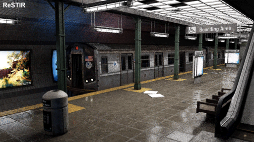

ReSTIR效果不错，但相比Ref.偏暗，原因是在SpatialTemporal策略中，多重采样的权重还是常量。而这个假设是不正确的。

对于空域而言，一个临近样本可能在当前像素下是不可见的，但仍然占了多重采样的权重，其结果是$\sum_im_i(x)<1$，导致偏暗。为了达到无偏，如果我们计算所有$m_i(x)$，时间复杂度是$O(M^2)$，这里，提供了两种MIS权重的计算方式，第一是在空域采样复用后，我们额外进行一遍空域采样的可见性判断，得到一个正确的可见光的数目$Z$，用这个纠偏参数来更新最终采用样本的贡献权重，提供debiase的能力：

$$
W_Y = \frac{1/|Z|}{1/M}\frac{1}{\hat{p}(Y)}\sum_{j=1}^M\omega_j
$$

另一个是pairwise MIS技术：

$$
m_i(x)=\frac{p_i(x)}{p_1(x)+(M-1)p_i(x)}
$$
$$
m_1(x)=\frac{1}{M-1}\sum_{i=2}^M\frac{p_1(x)}{p_1(x)+(M-1)p_i(x)}
$$

这样，我们在之前遍历所有空域样本时就更新所有样本的MIS权重，在这个遍历过程后同时获取$m_1$公式中的求和部分，在更新$m_1$权重，如此，保证了MIS权重更新的复杂度为$O(M)$。

另一个技巧是，在样本复用时，通过一些常用的技巧判断样本和当前像素样本的相似的，比如法线的方向和深度等，觉得不合适直接就不尝试了，提供一种临近样本的rejection能力，突然想到了某句歌词“好不容易 怎么你却不敢了呢”。 对比效果如下：

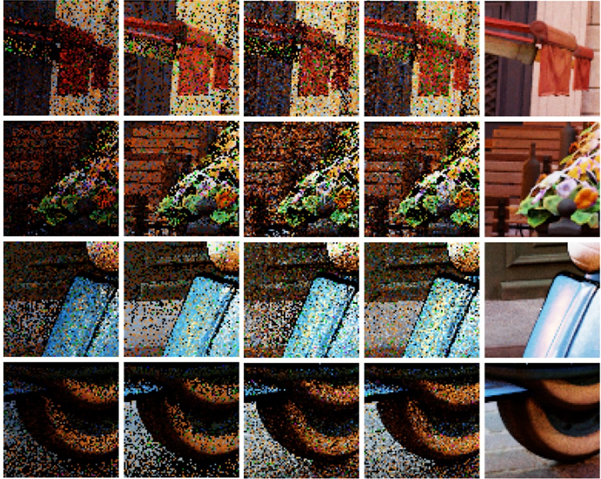

而在时域中，当前帧和上一帧各占50%，这也并不合理，等同于上一帧积累的样本会丢失一半，因此，提出了coinfidence weight $c_i$，然后乘以该路径的贡献值，来更新每一帧对应的MIS权重：

$$
m_i(x)=\frac{c_i\hat{p}_i(x)}{\sum_{j=1}^Mc_j\hat{p}_j(x)}
$$

## ResTIR PT

之前都是考虑的直接光照，仅支持primary ray，现在，我们将该算法扩展到整个Path Tracing。这里主要用的技术是shift mapping，因为涉及到渲染方程对应的积分域的变化，通过jacobian determinant实现积分的换元。

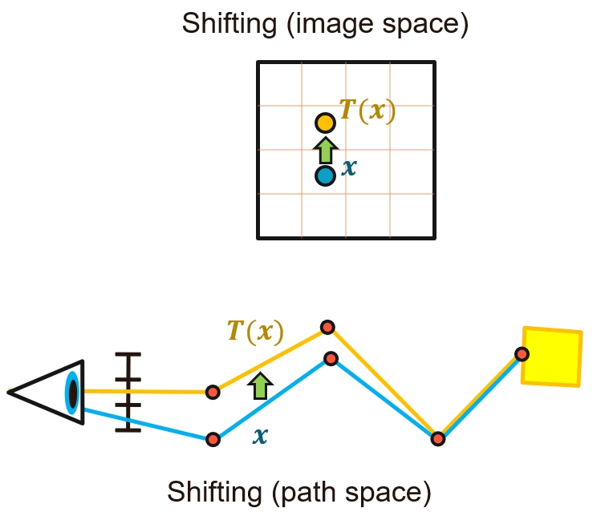

在这个过程中，我们需要计算出T函数对应的导数，通常对应的是reconnection对应的方向角导数，而新样本$Y$的PDF更新为：

$$
p_{Y_i}(y)=p_{X_i}(T_i^{-1}(y))|T_i^{-1^\prime}(y)|
$$

ReSTIR中也优化了shift mapping的策略：

- distance&roughness约束条件
- random replay
- unique reconnection

distance针对BRDF中的G函数进行优化，避免出现distance过小，导致firefly问题，roughness则针对glossy和specular的优化；random replay中，新的样本$Y$和$X$采用相同的随机数生成，然后在第一个可以reconnection时保证之后的path均相同（从相机出发），保证了两者的相似性，而随机数带来了内存开销的降低；unique则保证reconnection的点是唯一的顶点。

该算法同样也扩展到体渲染中，并提供了额外的shift mapping优化策略，本文不涉及这部分内容。

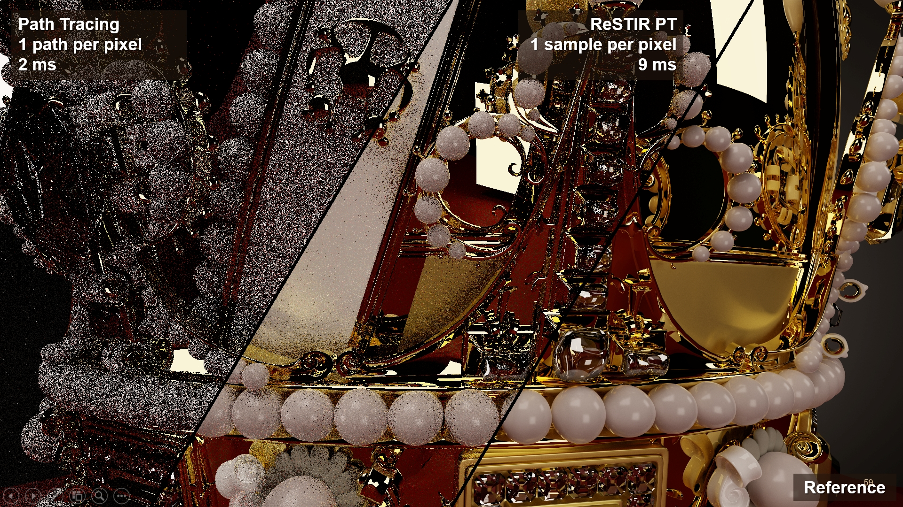

## Low Level Optimization

在实际应用中，随机算法对GPU并不友好，会导致divergence问题。而从渲染结果果而言，输出比输入更有coherent。这个结论也简介证明了我们之前的假设“周边像素具有相似性，且不需要处理场景中每个像素的许多灯光。只需要处理随机选择的一小部分灯光”。一种优化方案是对光源进行LOD。环境光是纹理，因此可以很好的实现LOD策略，而对于具体的多光源（百万级别），我们随机采样的光源都存入一个子集，以这样的方式构建多个子集，每一帧随机选择一个子集，然后只采样该子集中的光源，实现对离散光源的LOD。其次就是基本的避免megakernel以及compaction保证紧凑的思想。

另外，性能的瓶颈还是visibility，提出了visibility reuse这种biased trick,比如每隔一帧计算依次visibility，另一帧利用上一帧的visibility。

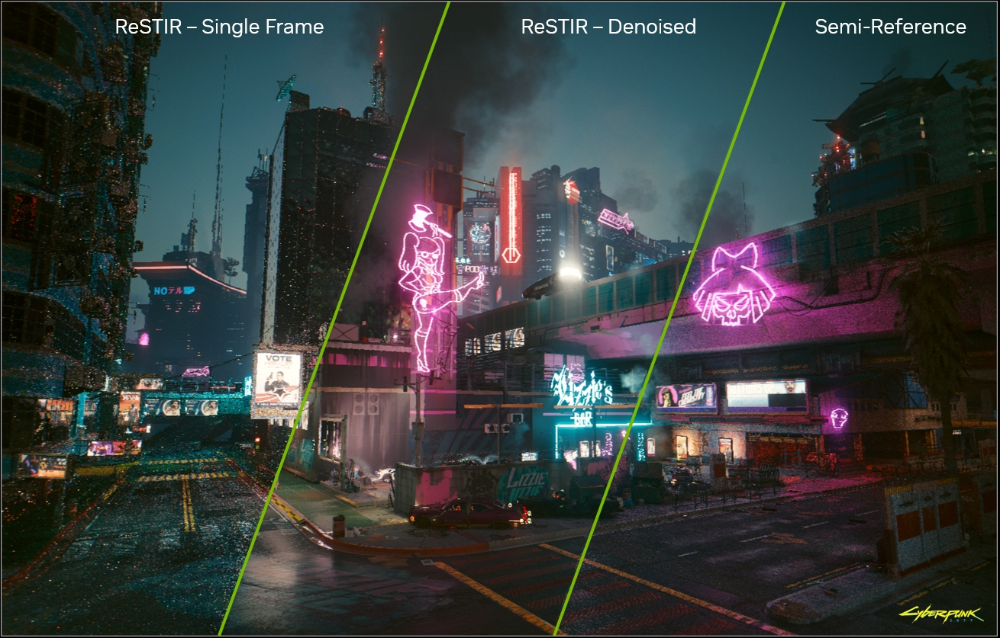
