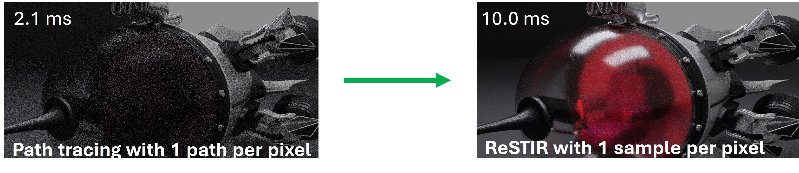

## 简介

Resevoir-based Spatiotemporal Importance Resampling (ReSTIR)主要有三部分的内容，第一是Resampled Importance Sampling（RIS），是该算法的理论基础；第二点是Weighted Reservoir Sampling（WRS），使得该算法具备streaming，对GPU友好，第三则是Spatiotemporal Reuse，通过像素间的复用能力，保证该算法在实时上的高效。简而言之，ReSTIR是一种通过像素之间共享来重用样本的方法，可以理解为渲染阶段的降噪技术，并且可以做到无偏（unbiased）。

自第一篇论文'Spatiotemporal reservoir resampling for real-time ray tracing with dynamic direct lighting'在2020年发表后， 该技术得到快速发展，且NV为代表的诸多产品中得到应用。

## IS

介绍Resampled Importance Sampling (RIS)之前，我们需要简要的提一下Importance Sampling （IS）。

$$
I = \int_{\Omega}f(x) \mathrm{d}x \approx \left< I \right> = \frac{1}{M} \sum_i^M \frac{f(X_i)}{p(X_i)},
$$

这里，$f$可以是任意目标函数，在本文中对应渲染方程。通常通过蒙特卡洛采样来求解该积分。$\left< I \right>$对$I$的一个无偏一致的估计，$p$是 probability density function (PDF), 满足$\int_{\Omega} p = 1$，$X_i$是随机神生成的样本。蒙特卡洛求解积分会有噪声（noise）的问题，通常会有两种方式来解决噪声

$$
\left< I \right> =\begin{cases}
	\left| \Omega \right|{\color{blue} \frac{1}{M}\sum_i^M{f\left( X_i \right)}}&		p\left( X_i \right) =\frac{1}{\left| \Omega \right|}\\
	\frac{f\left( X_i \right)}{p\left( X_i \right)}&		p\left( X_i \right) =If\left( X_i \right)\\
\end{cases},
$$

第一种方式是增加样本数$M$。该预估会收敛为$I$。假设这里的PDF是一个uniform distribution（如上第一行），显然，样本数量越多，平均值（蓝色）越准确，我们就可以得到一个更准确的预估值$\left< I \right>$。这是一种可行的方式，但代价也很大，因为需要足够多的样本。

第二种方式则是让采样的PDF $p$的分布接近于目标函数$f$。假设我们有一个完美的PDF分布（如上第二行），我们仅需要一次采样，便可以获取正确的积分解。可见，IS要解决的问题就是如何找到一个更好的PDF分布，从而只需要较少的采样数来达到好的效果。

如上图所示，对渲染方程而言，找到一个好的PDF是一件异常困难的事情。针对光源，我们有一个理想的分布，但如果有上百万的光源则会增大获取该分布的难度，同理，我们也需要考虑材质中brdf的分布，物体遮盖导致的可见性的分布以及物体间的几何关系（Geometry Term）,如果把这些因素放在一起，很难找到一个方程来描述该方程几乎是不可能的事情（从Path Guiding的角度而言，这是一个5D（空间位置+角度）的问题）。

## RIS

相比IS， RIS采样中也需要一个PDF $p$，一个目标方程$f$和其对应的目标分布函数(PDF)$\hat{p}$。采样方式如下：

- 根据$p$生成$M$个样本$(X_1,...,X_M)$
- 样本$X_i$有一个重采样权重$\omega_i=m_i(X_i)\hat{p}(X_i)W_{X_i}$
- 从$M$个样本中根据$\omega_i$成比例选取样本$X$
- 计算样本$X$的$W_X$，获取$\left< I \right> = f(X)W_X$

这里，$m_i$是MIS权重，假设样本分布均已，$m_i=\frac{1}{M}$，$W_X=\frac{1}{\hat{p}(X)}\sum_{j=1}^M\omega_i$则是选中样本$X$的权重。这里，RIS采用权重这个概念来代替PDF，两者互为倒数。

这里存在一个同样的问题，我们的目标分布$\hat{p}$是不现实的，所以，通常我们用$\hat{p}(X) \approx f(x)$来代替，因为，目标分布都是和目标函数成正比的。这样做有两个好处，第一，我们的目标函数$f$没有normalized的限制，第二，用目标函数来采样自然会考虑目标函数中的所有因素的综合分布，这样，对用户采样所用的$p$的要求不需要太高，并不需要是一个analytical PDF。最终，可得RIS：

$$
\left< I \right> = f(X)W_X = f(X)\frac{1}{\hat{p}(X)}\sum_{j=1}^M\omega_i
$$

$$
=\sum_{j=1}^M\omega_i=\frac{1}{M}\sum_{j=1}^M\frac{f\left( X_i \right)}{p\left( X_i \right)}
$$

从结果来看，RIS和IS是相等的，而RIS仅需要一个样本$X$，就可以得到和IS中M个样本的结果相同。这里，$W_X$虽然是样本$X$的权重，但其对应的函数参数包含所有之前随机样本$X_i$，RIS可以看作是一个样本聚合器(Sample Aggregation)。从输出看，RIS会盲目的提供一种具有较高概率的样本和其权重，具备blind IS的能力，可以看作是一个无需学习的Path guiding技术。

我们提到我们会用目标函数$f$来替代我们的目标分布$\hat{p}$。在渲染$\hat{p}(X)\approx = ρ\cdot L_e \cdot G \cdot {\color{blue} V }$时我们会忽略渲染方程中Visibility这一项，因为这一项需要执行一次shadow ray，这个开销在实时中是无法接受的。另一个问题是该算法中，我们需要保存M个样本，才能获取每个样本对应的权重$\omega_i$，这个$O(M)$的空间复杂度对GPU也是不可接受的。这个问题需要借助Reservoir Sampling来解决。

## WRS

$$
Pr\left[ choose\,\,i \right] \,\,=\begin{cases}
	\frac{w_{m+1}}{\sum_{j=1}^{m+1}{w_j}}&		i=m+1\\
	\frac{w_i}{\sum_{j=1}^m{w_j}}\left( 1-\frac{w_{m+1}}{\sum_{j=1}^{m+1}{w_j}} \right)&		i\ne m+1\\
\end{cases},
$$

weighted reservoir sampling(WRS)是一种流式采样技术。针对一个新样本，我们的接收新样本的概率以及相应的保持旧样本的概率公式如上。

基于如上算法实现了Streaming RIS的能力，最终实现如下的渲染效果。

## RIS with MIS

对于Glossy的部分，因为之前的采样策略是从光源采样，而没有考虑BSDF采样策略。因此，类似光线追踪中的NEE策略，我们也可以在RIS采样中提供两种采样策略$area$和$brdf$，来提高渲染质量。实现RIS算法和MIS采样的结合。

之前我们$m_i=\frac{1}{M}$。这里默认多个采样策略有着相同的分布，或者至少分布的域（support）相同（正确，但可能会有奇异值的过大过小，导致方差过大）。如果不同的采样策略所覆盖的集合不同时，则算法有偏。因此，通常我们需要采用Balance Heuristic。

## Spatiotemporal Reuse

前面已经证明，基于RIS的重采样，一个Reservoir可以得到一个较好的分布。那如果我们能够对Reservoir再做一次重采样，理论上应该能获得一个更好的分布。

和Denoiser相似，我们也尝试在Spatial和Temporal两个方面来探索如何低成本的复用Reservoir中的样本。

这里，会引入shift mapping技术，用来实现样本复用的能力。如下图，我们基于来自邻居的base path，构建一条针对当前像素下的offset path，作为新的样本，实现Reuse的能力。这样，我们的问题则是如何低成本的利用现有的样本。

对于Direct lighting（上图左侧），因为光路很简单，我们可以重新计算offset path对应的PDF $\hat{p}_i(r^\prime_y)$来进行一次权重的纠偏，新样本的权重更新为$w_{r^\prime} = \hat{p}_i(r^\prime_y) \cdot r^\prime.W \cdot r^\prime.M$。然后用{$r^\prime_y, w_{r^\prime}$}实现样本的复用。

对于上图右侧的通用场景，因为光路可能比较复杂，重新计算offset path对应的radiance贡献的计算量会比较大，所以会采用shift mapping来近似求解。

在这个过程中，涉及到渲染方程对应的积分域的变化，通过jacobian determinant实现积分的换元，而新样本$Y$的PDF更新为：

$$
p_{Y_i}(y)=p_{X_i}(T_i^{-1}(y))|T_i^{-1^\prime}(y)|
$$

$$
|T_{i}^{-1^{\prime}}(y)|=|\frac{\partial y_{k-1}}{\partial x_{k-1}}||\frac{\partial y_k}{\partial x_k}|=\frac{{p^y}_{k-1}{G^y}_k{p^y}_k}{{p^x}_{k-1}{G^x}_k{p^x}_k}
$$

ReSTIR中也优化了shift mapping的策略：

- distance&roughness约束条件
- random replay
- unique reconnection

distance针对BRDF中的G函数进行优化，避免出现distance过小，导致firefly问题，roughness则针对glossy和specular的优化；random replay中，新的样本$Y$和$X$采用相同的随机数生成，然后在第一个可以reconnection时保证之后的path均相同（从相机出发），保证了两者的相似性，而随机数带来了内存开销的降低；unique则保证reconnection的点是唯一的顶点。

Shift mapping也可以扩展到体渲染中，并提供了额外的优化策略，本文不涉及这部分内容。

最后一个优化是针对visibility，刚才提到，我们在计算贡献时并没有考虑每一个样本的可见性，这个开销太大，但我们可以对最终选择的样本进行一次可见性测试，如果不可见，则更新$r.W = 0$。

## Unbiased MIS

偏暗的原因是在SpatialTemporal策略中，多重采样的权重是常量$\frac{1}{M}$。而这个假设是不正确的。

同时，对于为了达到无偏，如果我们计算所有$m_i(x)$，时间复杂度是$O(M^2)$，这也是一个性能的瓶颈。

这里，提供了两种MIS权重的计算方式。一，Debias，在空域采样复用后，我们额外进行一遍空域采样的可见性判断，得到一个正确的可见光的数目$Z$，用这个纠偏参数来更新最终采用样本的贡献权重，该方法能保证结果无偏，但因为这种recount并不准确，副作用是variance增高：

$$
W_Y = \frac{1/|Z|}{1/M}\frac{1}{\hat{p}(Y)}\sum_{j=1}^M\omega_j
$$

另一个是pairwise MIS技术：

$$
m_i(x)=\frac{p_i(x)}{p_1(x)+(M-1)p_i(x)}
$$
$$
m_1(x)=\frac{1}{M-1}\sum_{i=2}^M\frac{p_1(x)}{p_1(x)+(M-1)p_i(x)}
$$

这样，我们在之前遍历所有空域样本时就更新所有样本的MIS权重，在这个遍历过程后同时获取$m_1$公式中的求和部分，在更新$m_1$权重，如此，保证了MIS权重更新的复杂度为$O(M)$。

另一个技巧是，在样本复用时，通过一些常用的技巧判断样本和当前像素样本的相似的，比如法线的方向和深度等，觉得不合适直接就不尝试了，提供一种临近样本的rejection能力，突然想到了某句歌词“好不容易 怎么你却不敢了呢”。 对比效果如下：

而在时域中，当前帧和上一帧各占50%，这也并不合理，等同于上一帧积累的样本会丢失一半，因此，提出了coinfidence weight $c_i$，然后乘以该路径的贡献值，来更新每一帧对应的MIS权重：

$$
m_i(x)=\frac{c_i\hat{p}_i(x)}{\sum_{j=1}^Mc_j\hat{p}_j(x)}
$$

## Low Level Optimization

在实际应用中，随机算法对GPU并不友好，会导致divergence问题。而从渲染结果果而言，输出比输入更有coherent。这个结论也简介证明了我们之前的假设“周边像素具有相似性，且不需要处理场景中每个像素的许多灯光。只需要处理随机选择的一小部分灯光”。一种优化方案是对光源进行LOD。环境光是纹理，因此可以很好的实现LOD策略，而对于具体的多光源（百万级别），我们随机采样的光源都存入一个子集，以这样的方式构建多个子集，每一帧随机选择一个子集，然后只采样该子集中的光源，实现对离散光源的LOD。其次就是基本的避免megakernel以及compaction保证紧凑的思想。

另外，性能的瓶颈还是visibility，提出了visibility reuse这种biased trick,比如每隔一帧计算依次visibility，另一帧利用上一帧的visibility。

