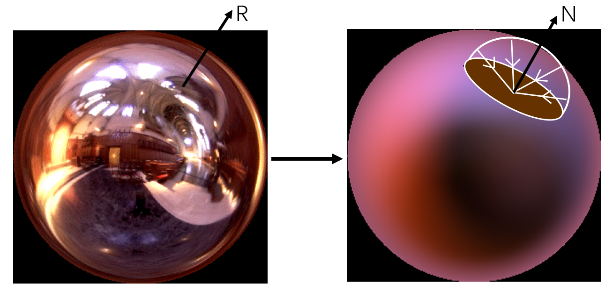
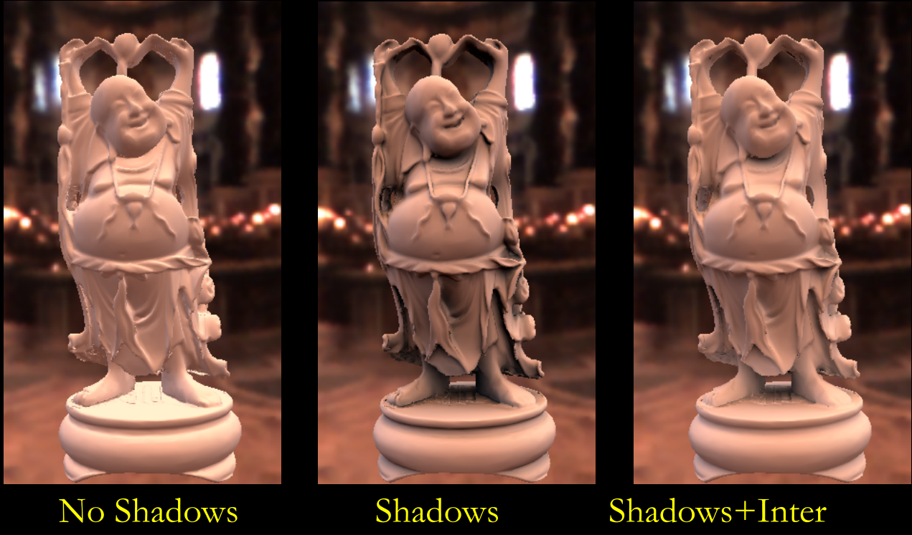
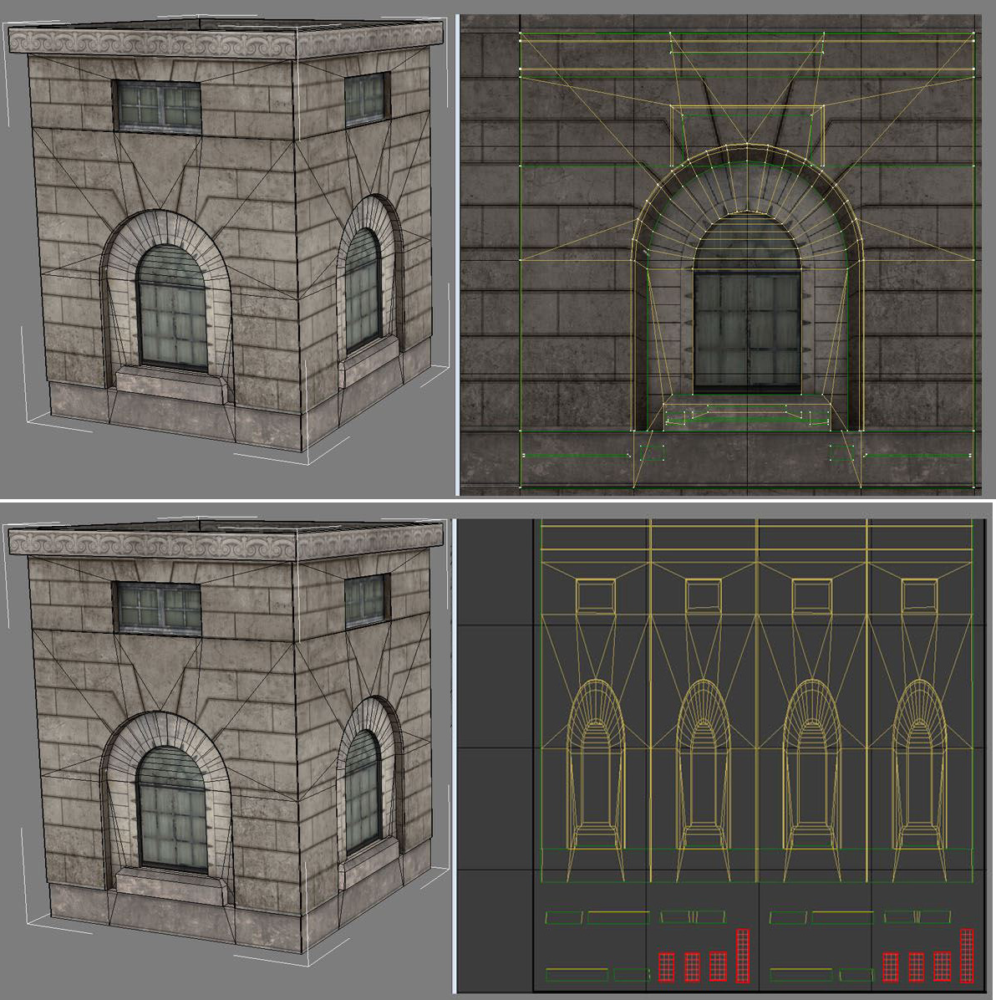
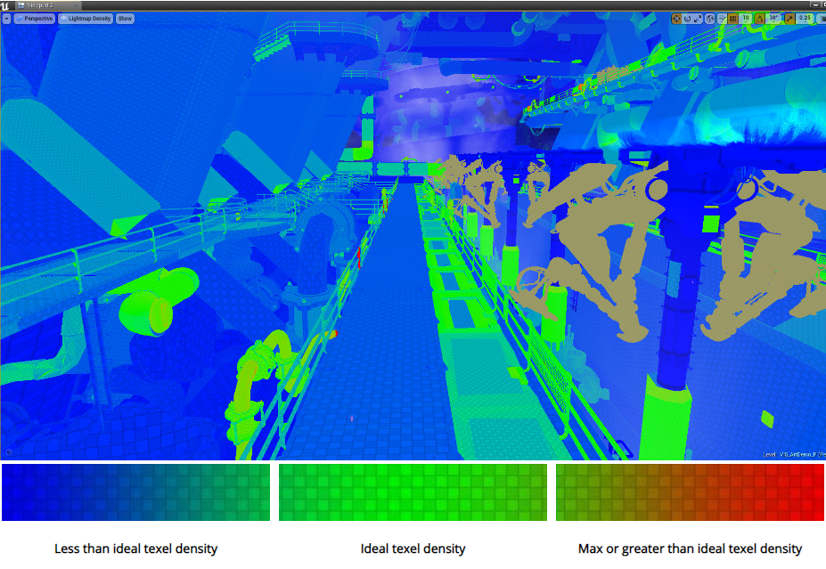
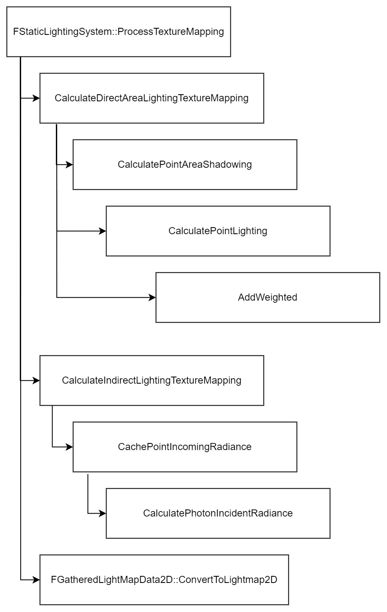
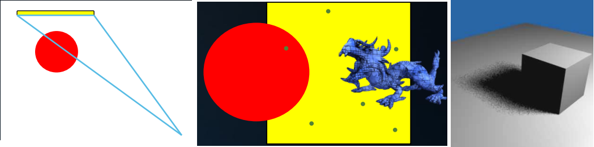
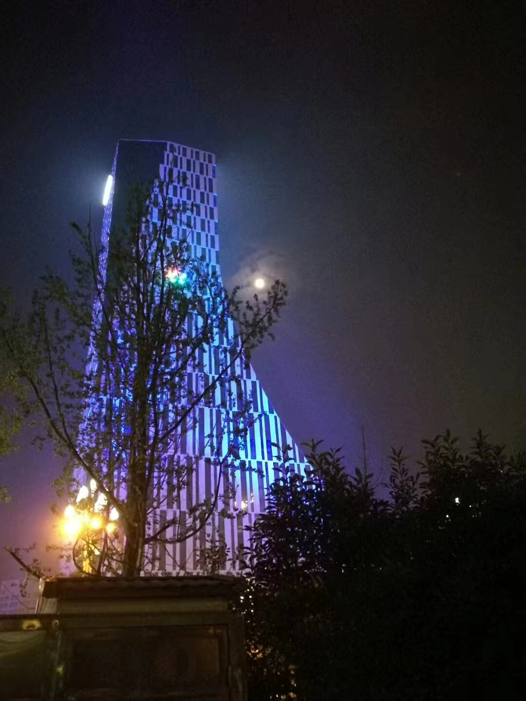

> 我的模样有你的孤单 --- 《模样》

今天介绍一下UE中的lightmap（LM）技术，lightmap算是一个高级版的irradiance environment map（envmap），而[irradiance envmap](https://graphics.stanford.edu/papers/envmap/envmap.pdf "An Efficient Representation for Irradiance Environment Maps")则是Ravi教授在2001年首次将球谐引入到图形学中。所以，本文先介绍irradiance envmap技术，如何使用球谐函数；然后介绍LM对envmap的升级，最后是UE中如何生成和使用LM。

## irradiance environment map



$$
E\left( n \right) =\int_{\Omega \left( n \right)}{L\left( \omega \right) \left( n\cdot \omega \right) d\omega}
$$

所谓环境光，就好比站在舞台中心的你，四面八方的灯光都打在了你的身上。如果我们要计算环境光对某一点的作用，对应如上的公式，$L$是光源，$\omega$是光源的方向，$n$是该点对应的法线，积分则是接受所有可能方向的光源贡献。这个过程简单明了，但有一个致命问题，整个球面每一个点都要做一次查询，计算量太大了。考虑到漫反射低滤波的特性，如果我们能把整个球面的光源先汇总到一个点上，这样只需要查询一次。这就是上图左右两侧在计算思路上的不同。而关键点在于前移积分，让其发生在查询前。

四面八方这个词用的好，说明这个光源的分布对应的是一个球，那我们就把光投影到球面上吧，上一篇的球谐函数就用了用武之地：

$$
L\left( \omega \right) =\sum_{l,m}{L_{lm}Y_{lm}\left( \omega \right)}
$$

我们把光源投射到球谐函数的一组基函数上，每一个基函数对应一个$Y_{lm}$勒让德多项式，仅有$\omega$一个参数，而$L_{lm}$是该项的系数，假设是一个常数。

$$
E\left( n \right) =\int_{\Omega \left( n \right)}{\sum_{l,m}{L_{lm}Y_{lm}\left( \omega \right)}\left( n\cdot \omega \right) d\omega}
\\
\Rightarrow E\left( \theta ,\phi \right) =\sum_{l,m}{\hat{A}_lL_{lm}Y_{lm}\left( \theta ,\phi \right)}
$$

如上，思路就是对积分中的各个部分用球谐的方式来替换。向量$n$转为$(\theta ,\phi)$形式，这里是局部坐标和全球坐标之间的转换，对用一个欧拉角；余弦$(n \cdot \omega)$对应的球谐转换后，产生了$\hat{A_l}$项；积分部分的消失则是光源对应的基函数与余弦对应的基函数相乘，因为球谐的基函数的正交性而抵消。

之前我们说，$L_{lm}$是一个常数，我这么沉稳的人，能有什么坏心思：

$$
L_{lm}=\int_{\theta =0}^{\pi}{\int_{\phi =0}^{2\pi}{L\left( \theta ,\phi \right) Y_{lm}\left( \theta ,\phi \right) \sin \theta d\theta d\phi}}
$$

强调的是，这里的$(\theta ,\phi)$是世界坐标系下的角度，我们有了环境光贴图，上面这个积分是可以预计算的，最终得到的是$L_{lm}$。如下我们默认采用三阶的球谐函数，总计有9个基函数，而每一个基函数对应一个常量$L_{lm}$。

同时，基函数$Y_{lm}\left( \theta ,\phi \right) $对应的勒让德多项式展开后如下：

$$
(x,y,z,1)=(\sin \theta \cos \phi ,\sin \theta \sin \phi ,\cos \theta )
\\
Y_{00}\left( \theta ,\phi \right) =0.282095
\\
\left( Y_{11};Y_{10};Y_{1-1} \right) \left( \theta ,\phi \right) =0.488603\left( x,y,z \right) 
\\
\left( Y_{21};Y_{2-1};Y_{2-2} \right) \left( \theta ,\phi \right) =1.092548\left( xz,yz,xy \right) 
\\
Y_{20}\left( \theta ,\phi \right) =0.315392\left( 3z^2-1 \right) 
\\
Y_{22}\left( \theta ,\phi \right) =0.54627\left( x^2-y^2 \right) 
$$

搞定了$L_{lm}$和$Y_{lm}$，场景中任意一点，只需要知道该点的法向量$n^t=(x,y,z,1)$，我们可以得到如下：

$$
E(n)=n^tMn
$$

假设我们有一个天空盒作为环境光贴图，每个面的分辨率是$64*64$，原本计算量是$64*64*6$，现在，通过球谐函数，只需要一个矩阵乘向量以及点乘，$M$是一个4*4矩阵，而Ravi教授当年就是凭借短短四行代码拿到了博士学位。如下是效果的对比：



简单回顾一下，球谐函数的作用是将积分部分转为预计算，最终保留在基函数的参数中，而查询则对应求和操作，对应一次查询，而参数是法线$n$。另外，我们在环境光漫反射中并没有考虑Visibility的问题，这等同于我们在预计算中把场景中所有的物体都拿走，场景中预计算完全一样，计算光源贡献时共用一个矩阵$M$。

如果需要考虑V项，在预计算中考虑（乘以）V即可。但因为V和物体$O$有关联，不同位置的V是不同的，所以如同纹理贴图一般，需要针对物体$O$创建LM的UV，对应不同的矩阵$M_{uv}$。

这也是Lightmap和irradiance envmap的主要区别。通常，后者是天空盒这类的Skylight，不考虑物体的可见性，因此是全局一个球谐函数矩阵$M$，而Lightmap则是对应场中的物体$O$，创建对应的UV，然后计算UV下对应的球谐函数矩阵$M_{uv}^O$。下面，我们看一下UE中的Lightmap。

## Lightmap

逻辑上很简单，创建UV，然后逐点做一次上面的操作，将矩阵$M$保存在光照贴图中。可是，生活不是诗，平淡生活中的那些刺，如同碎瓶上那浅浅而深邃的裂痕，不易发现却无处不在。



上图是纹理UV和LM的UV的不同，纹理UV不需要考虑光源的影响，而LM中不同位置下收到的光源的影响也不同，因此每一个位置都需要独一无二的UV。其次，UV贴图如果不合理，比如分辨率或padding不充分，有可能会产生漏光（light leaking）问题，这是相邻点插值影响导致。我对如何生成LM的UV算法，并没有研究，刚才说的都是看UE的文档了解的，假设我们现在已经创建了UV。



UE中还可以选择显示LM的密度，可以查看LM的分辨率设置是否合理。

## UE pipeline

UV贴图准备就绪，下面就是如何生成LM内容了。这部分我没法调试，只能看代码，所以不太确定理解的是否准确，很多逻辑都是自圆其说，我承认有赌的成分。本部分纯属虚构，欢迎追究法律责任。



UE的LM采用了2阶，光源包括直接光照和间接光照两个贡献。如上图，生成LM的入口是在```FStaticLightingSystem::ProcessTextureMapping ```，首先，根据TextureMapping的高度和宽度，创建对应的```LightMapData```容器，该容器中元素类型是```FGatheredLightMapSample```，保存该点$(u,v)$对应的球谐函数的参数。

有了容器后，首先计算直接光照的球谐贡献，对应方法```CalculateDirectAreaLightingTextureMapping```，该方法会遍历UV贴图，对应两个```for```循环，贴图中每一个像素，计算光源对该点的光照强度```LightIntensity```和软阴影程度```Transmission```，都是```FLinearColor ```对象。前者只要基于光源本身的强度，光源类型以及随距离衰减等因素；后者则基于蒙特卡洛采样的方式，估算面积光下的软阴影比例，如下图，在光源面上随机生成N个点，连接该点和物体的某点，判断光源和物体之间是否有遮盖物，根据结果得到软阴影的值。



这样，我们有了光源$L(\theta,\phi)$以及可见性$V(\theta,\phi)$，在加上该点的法线$n(x,y,z,1)$，基于这些参数，```CalculatePointLighting```方法中实现了对该贡献的球谐函数转换，UE中称为```FGatheredLightSample```对象，对应球谐函数中$L\left( \theta ,\phi \right) Y_{lm}\left( \theta ,\phi \right)$，```TGatheredLightSample<SHOrder>::AddWeighted```实现该$UV$点所有光源贡献的累加，对应积分的部分。最终，基于上面两个方法，根据公式获取该点的$L_{lm}$。

间接光部分我并没有深入了解具体技术细节，涉及的内容可以开一个专题。本质是基于之前的Photon Mapping技术，估算出该点的irradiance，然后根据irradiance，创建对应的```FGatheredLightSample```对象，接下来就和直接光的部分是相同操作。

这里，有一个我不太确定的地方：

```C++
FGatheredLightSampleUtil::PointLightWorldSpace()
{
    Result.SHVector.AddIncomingRadiance(Color, 1, WorldDirection);
    FSHVector2 SH = FSHVector2::SHBasisFunction(TangentDirection);
    Result.SHCorrection = Color.GetLuminance() * (0.282095f * SH.V[0] + 0.325735f * SH.V[2]);
}
```

这里，不仅计算了该光源和基函数的乘积(AddIncomingRadiance)，还计算了在局部坐标下光照```SHCorrection```，看上去像是沿着法线射入的光照能量最大的情况，为了后面归一化，能量守恒的作用，但不明白为什么要这么算的理论依据。

最后，我们的容器对象是```FGatheredLightSample```，```PadTextureMapping```用来避免重叠等漏光问题，最后调用```ConvertToLightSample```转换为```FLightMapData2D```对象格式。这里，包括```HighQuality```和```LowQuality```两种类型。```OutCoefficients[0]```的第一行存储光照的颜色信息```FLinearColor```，而```OutCoefficients[1]```第二行存储球谐的系数$L_{lm}$

当然，在输出最终的LM时，还会执行数据压缩，向量化的过程，会有一些有损压缩的小技巧在里面。

### Skylight

另外，Skylight也涉及到同样的操作，但Skylight不会考虑物体的可见性问题，天圆地方，场景中任意一点都是中心点，然后计算Skylight对该点贡献对应的球谐基函数的参数。UE中采用三阶，最终对应9个参数。

不确定生成环境光的irradiance贴图是否是这个方法，但思路是完全一样的，所以贡献都累计到```StationarySkyLighting```对象，然后记下来```StationarySkyLighting::SHVector```对应的系数。

```C++
// GatheredLightingSample
void AddIncomingStationarySkyLight()
{
    StationarySkyLighting.AddWeighted();
}
```

## Shader

生成的LM在Shader中的调用也很直接：

```C++
// LightmapCommon.ush
void GetLightMapColorHQ()
{
    // 获取光照颜色
    half3 UVW = ...;
    // 获取球谐系数L_lm
    float4 SH = ...;

    // 计算irradiance:n^tMn
    half Directionality = max( 0.0, dot( SH, float4(WorldNormal.yzx, 1) ) );
    half Luma = L * Directionality;
    // 计算radiance对应的color
	half3 Color = Luma * UVW;

    // 获取Diffuse光贡献
	OutDiffuseLighting = Color;
}
// 环境光贴图中的SH
float3 GetSkySHDiffuse()
{
    ...
    return max(0, Intermediate0 + Intermediate1 + Intermediate2);
}
```

UE中一个光源如何保证能量守恒，这块我还没查阅过，比如哪些光是通过LM的方式计算贡献，哪些是RenderLights，通过BRDF的方式，是按照static和dynamic区分，以及涉及到不同平台的质量LQ和HQ。另外，还涉及到阴影图等内容，很多谜团需要一点点的解惑。

## 总结

LightMap是我今年才了解的一个概念，最初是在Unity的SRP中介绍光照贴图的内容，看完之后一脸懵。后来，看到BabylonJS，以及threejs也支持，突然觉得这个看上去好像很重要的样子。读博后，在UE中遇到的第一个缺陷就是漏光问题，所以，了解了一些关于LM应用的内容，比如分辨率以及GPU创建LM等。所以，我本人也很好奇LM的具体技术实现，从今以后，听到光照贴图后，我可能不会心虚了。

本文介绍了irradiance environment map的原理，后来延伸到图形学中的Precomputed radiance transfer（PBR）领域，以及UE中如何生成LightMap，在Shader中如何使用lightmap的相关内容。



这张照片是我2017年某个夜晚，从公司办公楼下来时所拍摄的，当时耳机里正好播放的是许巍的'执着'。当听到那句“我想超越这平凡的生活，注定现在暂时漂泊”时，眼眶湿润，毕竟男子汉不许哭，所以我不会这样说。人都有迷茫的时候，就好比鲁迅写的，地上本没有路，走的人多了，也就成了路。所谓的迷茫，以我的经历就是社会循规蹈矩的给你安排了一条路，你不想走，可又找不到自己的路。这让我想到了白日梦冒险家中的男主人公Walter，如果你见过格陵兰，喜马拉雅和冰岛的火山，就再不会被生活打败。

可是，选一条少有人走的路太难了，而且，每个人无论如何坚持，最终都只是这宇宙中的一粒尘埃，何必挣扎呢，早点投降早躺平。所以，我并不鼓励我关心的人去追求那些飘渺的生活意义，我只希望他们开心，如果他们想要坚持自己的梦想，我希望他们能有一个积极的心态来努力，毕竟，人的选择有很多，看尽世界美景，品尝美味，感受不同的风土人文，有意义是用来修饰活着，而不是寻找的目标。再不行，如果还想坚持的话，希望你不是一个人前行，may the force be with you。

正是个人的这点经历，才让我想到了开头的那句歌词。人都会迷茫，这就好比修仙里的渡劫，渡劫本就是自己的事情，别人也帮不上什么。我唯一能做的，可能就是让迷茫的人不再孤单吧。