> 已经听了一百遍，怎么听都不会倦。 --- 《我们的歌》

在写这篇文章时，我在公众号下搜关键字“材质”，总计95篇原创中有33篇提到了材质，可见，材质是一个怎么说都说不完的内容，神奇的脑回路让我忍不住想听一下这首我们的歌，于是乎，宝贵的三十分钟成为了过去式。

材质的定义到底是什么？于我而言，最初的材质就是shader，它源自OpenGL超级宝典中的`Blinn-Phong`对应的shader代码，接着是OGRE中的材质类，傻傻分不清楚的`Pass`，`Technique`和`Material`，后来，因为WebGL产品需要定义Web端的材质规范，学习了`GLTF`等格式的材质规范，算是我对材质理解的1.0版本；接着，随着PBR材质的流行，对材质有了进一步系统的理解，比如经典的[Physically Based Shading at Disney](https://media.disneyanimation.com/uploads/production/publication_asset/48/asset/s2012_pbs_disney_brdf_notes_v3.pdf "Physically Based Shading at Disney")和[Real Shading in Unreal Engine 4](https://cdn2.unrealengine.com/Resources/files/2013SiggraphPresentationsNotes-26915738.pdf "Real Shading in Unreal Engine 4")，不同产品（AutoDesk系列，Bentley，Substance，UE&Unity，Babylonjs，Cesium，threejs等）在材质上不一样的理解，以及大同小异的PBR实现方式，这是我对材质理解的2.0阶段；最近对材质的一个新的理解是关于材质的`Nonlinear Prefiltering`，我们追求在Pixel级别下一个点对应的材质结果，但点本身是一个抽象概念，现实中每一个点都是一个微表面，对这个微表面，既要抽象，可以简化计算量，又要正确表达细节。所以材质可以是一个永恒的话题，感兴趣的可以访问公众号下的[**材质合集**](https://mp.weixin.qq.com/mp/appmsgalbum?action=getalbum&__biz=MzA5MDcyOTE5Nw==&scene=1&album_id=2518511104424198145&count=3#wechat_redirect)。

## UE材质

谈完我对材质的理解历程后，我们看一下UE的[材质定义](https://docs.unrealengine.com/4.27/en-US/RenderingAndGraphics/Materials/ "UE Materials Docs")：Controlling the appearance of surfaces in the world using shaders.这句话中有三个关键字（`appearance`，`surface`和`world`）和一个函数（`shaders`），可以抽象为一个数学公式：$Appearance = Material(surface, world)$。

## UE材质三要素

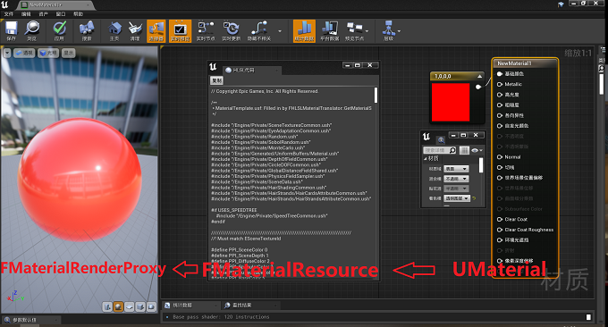

上图是UE材质编辑器，体现了UE材质的三大要素，从右向左则是对材质资产的处理过程。每个阶段的结果依次面向艺术家，机器以及普通人：

- UMaterial类：对应材质编辑器中的资源属性
- FMaterialResource类：将UMaterial生成HLSL代码，并依据`RHIFeatureLevel`（DirectX/Vulkan/Metal/OpenGL ES等）和材质质量`EMaterialQualityLevel`（高/中/低）编译和保存该代码
- FMaterialRenderProxy类：将编译后的shader传递给渲染层，通过材质函数完成渲染结果

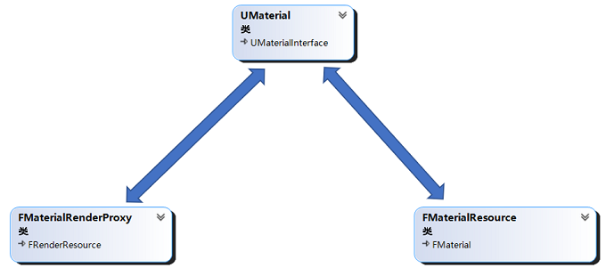

在UE内容中创造材质资产时，首先会调用`UMaterial`类的构造函数，然后依次调用`PostInitProperties`和`UpdateResourceAllocations`方法，实现`UMaterial`、`FMaterialResource`和`FMaterialRenderProxy`的相互关联。

```C++
// Material.cpp
// 伪代码
void UMaterial::PostInitProperties()
{
    if(!HasAnyFlags(RF_ClassDefaultObject))
    {
        // 关联UMaterial和FMaterialRenderProxy
        DefaultMaterialInstance = new FDefaultMaterialInstance(this);
    }
    // 关联UMaterial和FMaterialResource
    UpdateResourceAllocations();
}

void UMaterial::UpdateResourceAllocations()
{
    for (int32 FeatureLevelIndex = 0; FeatureLevelIndex < ERHIFeatureLevel::Num; FeatureLevelIndex++)
    {
        for (int32 QualityLevelIndex = 0; QualityLevelIndex < EMaterialQualityLevel::Num; QualityLevelIndex++)
        {
            // UMaterial::AllocateResource()      
        }        
    }    
}
```
代码在微信上阅读体验糟糕，请忽略或访问我在Github上的工程[Lost Temple](https://github.com/pasu/losttemple/blob/main/5_resources.md "pasu/losttemple")。因为`UMaterial`类和`FMaterialRenderProxy`互相引用，同时`FMaterialRenderProxy`只提供给内部的渲染模块使用，所以`DefaultMaterialInstance`的声明采用了[C++ PImpl](https://en.cppreference.com/w/cpp/language/pimpl "PImpl")技巧。

三要素的介绍基本结束，如果将UE的材质系统比喻为一个餐厅，`UMaterial`就是采购部，负责提供好的食材；`FMaterialResource`就是主厨，依据每日食材和食客的口味等各种情况，制定每天的菜单和菜谱；而`FMaterialRenderProxy`则依据客户需求以及菜单情况，协助完成上菜的整个流程（渲染管线）。

### UMaterial

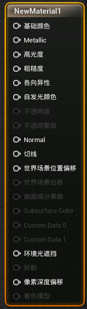

上图是UE中`UMaterial`对应的材质属性，这些属性作为材质函数中的输入参数，最终返回对应的颜色值。`UMaterial`类中私有变量`ShadingModelField`标识该材质对应的着色模型的枚举值`EMaterialShadingModel`。

目前的着色模型主要有默认光照、次表面、头发、布料、眼睛等11种类型，对应不同的枚举值。一个材质可以对应多个着色模型，通过二进制的与或操作来区分。

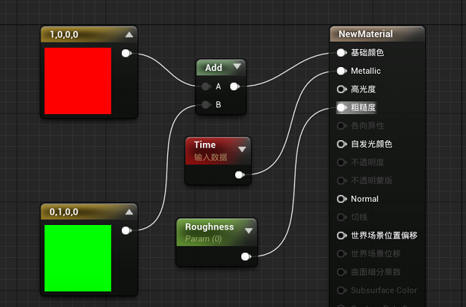

我们可以编辑该材质，通过`UMaterialExpression`材质表达式对不同属性设置具体的数值。上图中，我们选择了几个有代表性的类型，比如`Constant4Vector`对应的Red和Green，`ScalarParameter`对应的Metallic，以及`Time`的时间值和`UMaterialExpressionAdd`的加法表达式。UE中的表达式可以对应一个变量，也可以是一个运算符表达式。每次新增表达式时，则会触发`UMaterial::AddExpressionParameter`，最终保存到`UMaterial::Expressions`成员变量中，比如上图则对应了$5$个材质表达式。通过这种方式，我们实现了材质编辑的效果。

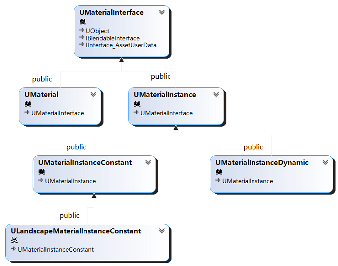

另外，UE的材质中还有`UMaterialInstance`类，通过成员函数`SetParentInternal`指定一个`UMaterial`对象，实现材质类的继承能力。比如一款衣服的材料相同，但对应不同的颜色。这样，不同颜色的衣服对应不同的`UMaterialInstance`对象，不同实例的`BaseColor`各不相同，但都指向一个相同的`UMaterial`对象。如上是完整的类图。最后，从应用上，UE还提供了材质函数，材质图层等复合材质的方式，以及材质参数集，方便用户模拟复杂的材质效果和材质参数的输入方式。

最后，我们试着实现一个[自定义材质模型](https://zhuanlan.zhihu.com/p/36840778 "自定义光照模型")。首先，在`EMaterialShadingModel`枚举中新增一个材质类型`MSM_MyShadingModel`:

```C++
// EngineTypes.h
enum EMaterialShadingModel
{
    MSM_Unlit                   UMETA(DisplayName="Unlit"),
    MSM_DefaultLit              UMETA(DisplayName="Default Lit"),
    MSM_Subsurface              UMETA(DisplayName="Subsurface"),
    MSM_PreintegratedSkin       UMETA(DisplayName="Preintegrated Skin"),
    MSM_ClearCoat               UMETA(DisplayName="Clear Coat"),
    MSM_SubsurfaceProfile       UMETA(DisplayName="Subsurface Profile"),
    MSM_TwoSidedFoliage         UMETA(DisplayName="Two Sided Foliage"),
    MSM_Hair                    UMETA(DisplayName="Hair"),
    MSM_Cloth                   UMETA(DisplayName="Cloth"),
    MSM_Eye                     UMETA(DisplayName="Eye"),
    MSM_SingleLayerWater        UMETA(DisplayName="SingleLayerWater"),
    MSM_ThinTranslucent         UMETA(DisplayName="Thin Translucent"),
    // Custom Shading Model
    MSM_MyShadingModel          UMETA(DisplayName ="MyShadingModel"),
    MSM_NUM                     UMETA(Hidden),
    MSM_FromMaterialExpression  UMETA(DisplayName="From Material Expression"),
    MSM_MAX
};
```

对于这个自定义的模型，通过`UMaterial::IsPropertyActiveInEditor`方法，可以控制其激活的材质属性，比如`CustomData0`；我们可以通过`FMaterialAttributeDefinitionMap::GetAttributeOverrideForMaterial`设置该属性在不同的材质模型下对应的别名，比如将`CustomData0`改为`折射率`。

此时，我们自定义材质的模型`MyShadingModel`有了枚举值，也可以传递自定义的属性值，最后一步是在`FHLSLMaterialTranslator::GetMaterialEnvironment`方法中设置对应的宏为`true`，在shader中激活该自定义材质类型:

```C++
void FHLSLMaterialTranslator::GetMaterialEnvironment()
{
    if (ShadingModels.HasShadingModel(MSM_MyShadingModel))
    {
        OutEnvironment.SetDefine(TEXT("MATERIAL_SHADINGMODEL_MyShadingModel"), TEXT("1"));
        NumSetMaterials++;
    }
}
```

shader中通过判断宏`MATERIAL_SHADINGMODEL_MyShadingModel`是否为`true`来判断是否采用该自定义的材质类型，实现自定义的材质效果。UE的自定义材质模型需要修改源码，重新编译。同时，`ShadingModelField`是`uint16`的限制，着色模型最多16个。

### FMaterialResource

`UMaterial`说，材质资产已经准备好了，接下来就看`FMaterial`。`FMaterial`的作用：

- 将面向艺术家的材质资产解释为面向工程师的材质shader脚本
- 将shader脚本编译为面向机器的代码片段。

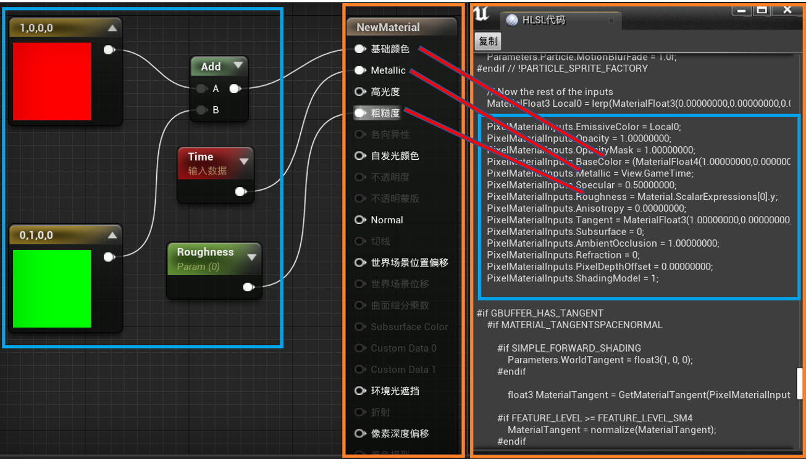

当我们在材质编辑器中点击：**窗口**---**着色器代码**---**HLSL代码**，会得到材质资产生成的shader代码，对应上图HLSL代码。橙色区域是PBR对应的材质资产，对应的是一个shader的模板，而我们要做的，就是在这个模板中，将材质表达式的部分填入到对应的位置，对应蓝色区域，而在我们的材质资产中，尽管存在五个材质表达式，但最终只修改了三个PBR属性：`BaseColor`，`Metallic`和`Roughness`，对应的是三个红色箭头的映射关系。

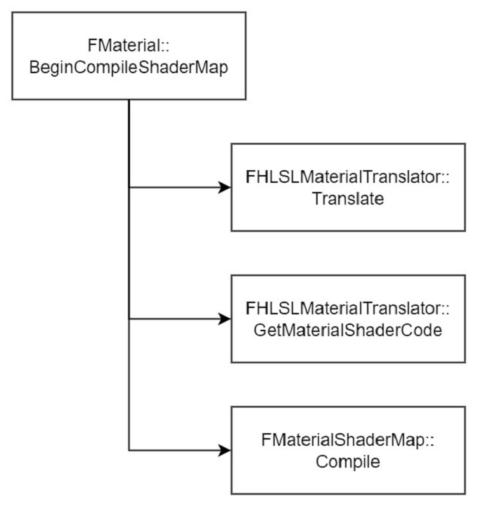

当需要生成对应的代码时，则会触发`FMaterial::BeginCompileShaderMap`,依次执行上图中的三个方法：

1. Translate：生成每个表达式的代码片段
2. GetMaterialSHaderCode：代码片段+`MaterialTemplate.ush`材质模板，生成HLSL代码
3. Compile：编译HLSL代码

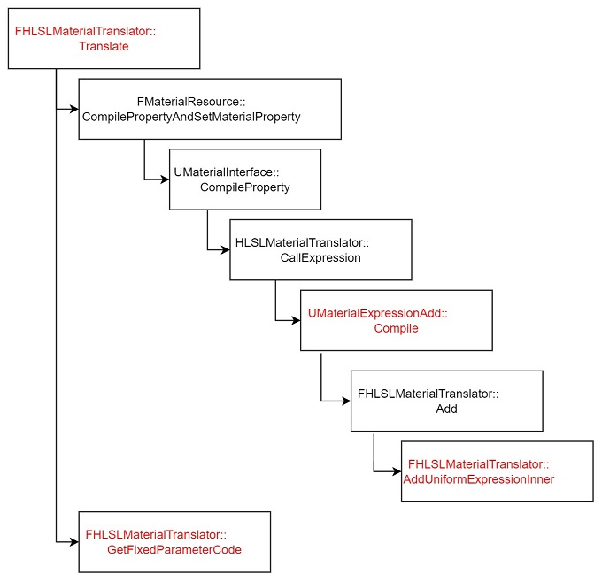

我们先看第一步：Translate。UE中是`FHLSLMaterialTranslator`负责生成HLSL代码的部分。在材质编辑器中将`Add`和`BaseColor`建立关联时，会触发`FHLSLMaterialTranslator::Translate`方法，然后执行上图中的流程。上图的流程可以看作是对一个树结构的遍历，每一个材质的属性是一个树的根节点。如果该属性绑定了`UMaterialExpression`（比如图中`BaseColor`属性关联了`UMaterialExpressionAdd`表达式），而`UMaterialExpressionAdd`对应的`Input`是两个`Constant4Vector`，一直遍历至叶子节点，以递归的方式（倒序）执行每个节点（材质表达式）的`Compile`方法，将每一个`Expression`转换为`UniformExpression`,并调用`FHLSLMaterialTranslator::GetFixedParameterCode`生成每个材质属性对应的代码片段。

然后是第二步，在`GetMaterialShaderCode`会读取UE提供的`MaterialTemplate.ush`材质模板，以通配符的方式用代码片段依次替换模板文件的`%s`等，纯字符操作,生成HLSL代码（`/Engine/Generated/Material.ush`）。

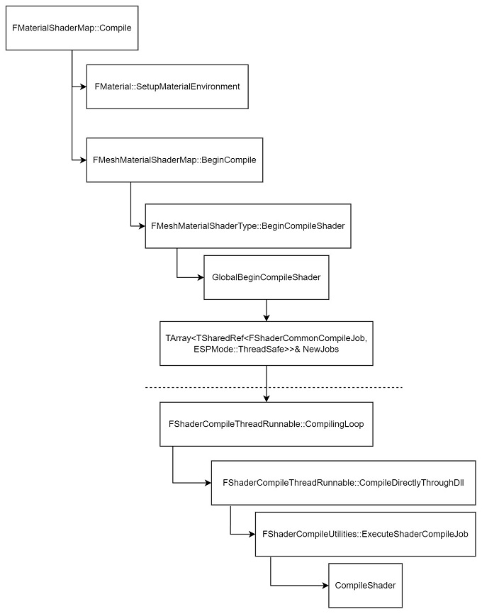

上图是第三步，编译HLSL代码，在Windows平台下，最终调用的是`ShaderFormatD3D`，这里的分水岭是虚线部分，虚线上面对应不同的Pass，对应不同的HLSL代码，准备完成后扔到`NowJobs`数组；虚线下是多线程编译`NowJobs`数组中的HLSL代码，最终保存在`FMaterial::RenderingThreadShaderMap`中。调试时为了方便，可以关闭多线程编译脚本：在`Engine\Config\BaseEngine.ini`文件中设置`bAllowCompilingThroughWorkers=False`和`bAllowAsynchronousShaderCompiling=False`。

这样，`FMaterial`主要依靠`FHLSLMaterialTranslator`和`FMaterialShaderMap`两个类，完成了材质资产根据当前的环境下生成shader代码并编译的过程。个人认为，UE的材质表达式本质上就是一个abstract syntax tree（AST），基于AST实现一些shader simplification[shader simplification](https://dl.acm.org/doi/abs/10.1145/1186822.1073212 "User-configurable automatic shader simplification")，或许是一个优化的思路。

### FMaterialRenderProxy

我们的材质资产从艺术家手中转为机器码后，最后需要通过`FMaterialRenderProxy`来实现和渲染管线`FDeferredShadingSceneRenderer::Render`的交互，最终渲染到屏幕中。

关于`FMaterialRenderProxy`，一方面，提供`GetMaterialWithFallback`获取对应的`FMaterial`，满足渲染管线的需要，比如获取渲染状态；一方面，提供`CacheUniformExpressions`实现uniform buffer的更新。我们这里只分析uniform buffer。

首先，材质shader对应的uniform变量来自（材质编辑器）材质表达式中的变量，包括三个来源：（1）固定常量；（2）系统视图（`FView`），比如Time等；（3）材质参数，比如`ScalarParameter`。

常量在生成HLSL代码时已经在shader中写死，不需要Uniform变量；来自`FView`的变量会在渲染中`FDeferredShadingSceneRenderer::InitViews`处理；`FMaterialRenderProxy`主要负责将材质参数从CPU更新到GPU中。

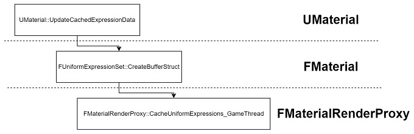

如上图的三个步骤：
- Collect
    - 在创建材质表达式时，如果新增的表达式属于材质参数，`UpdateCachedExpressionData`会将该表达式保存到`CachedExpressionData`
- Create 
    - 然后在`Translate`中创建对应的uniform buffer，UE中提供了`Material`和`MaterialUniforms`两个结构体，分别是普通参数和纹理相关的参数
- Update
    - 通过`CacheUniformExpressions_GameThread`更新Uniform buffer值

看到上面三个不同部门的类能够把一件事情畅通无阻的高效完成，我是一脸的羡慕。我们把重点放到第三步中的`FMaterialRenderProxy`，这里的关键是它的成员变量`DeferredUniformExpressionCacheRequests`。

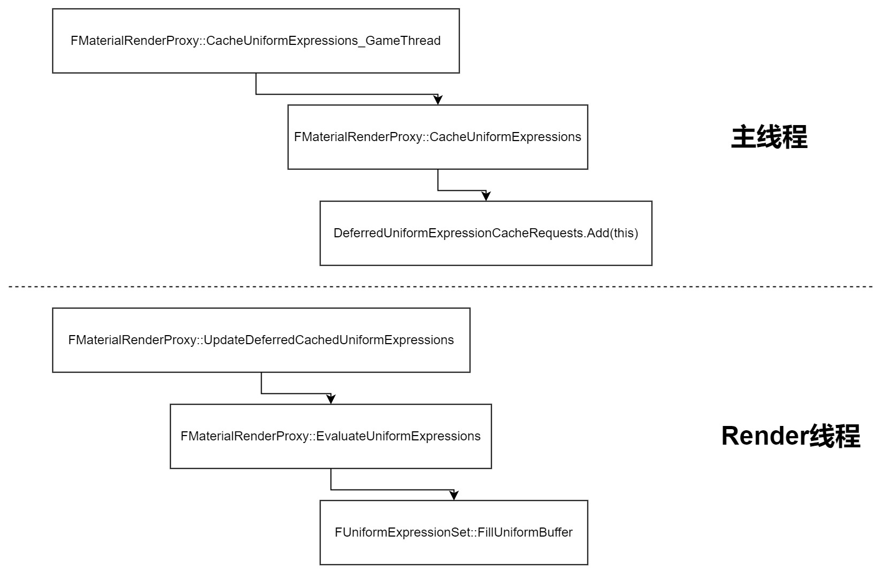

如上图是更新材质Uniform Buffer的流程，在主线程中，如果发现材质Uniform变量有变化，便会在`DeferredUniformExpressionCacheRequests`中追加，并更新状态；而在渲染线程中，发现数组长度不为0时，则会更新该材质的Uniform Buffer。最后，在渲染中完成ShaderBinding，实现渲染。

我在调试`FMaterialRenderProxy`代码时，一直有一个疑问，是否可以把其和`FMaterial`合并，为什么需要设计这样一个代理类。一个合理的解释是`UMaterial`：`FMaterial`：`FMaterialRenderProxy`是$1:N:1$的关系，所以需要这样一个代理类来选择合适的`FMaterial`，至于`FMaterialRenderProxy`在主线程和渲染线程之间的切换，涉及到的接口并不多，放到`FMaterial`中也是可以接受的方式。毕竟，两个类都在同一个文件`MaterialShared`中。

## 总结

本篇仅从材质编辑器入手，学习总结了基本的材质和着色器之间的基本概念和流程。主要介绍了UMaterial，FMaterial以及FMaterialRenderProxy三个部分，涉及材质表达式，HLSL代码，Uniform Buffer更新等相关内容。

初次学习UE，难免有一些理解错误，不准确的地方。一个人的精力是有限的，欢迎大家交流指正