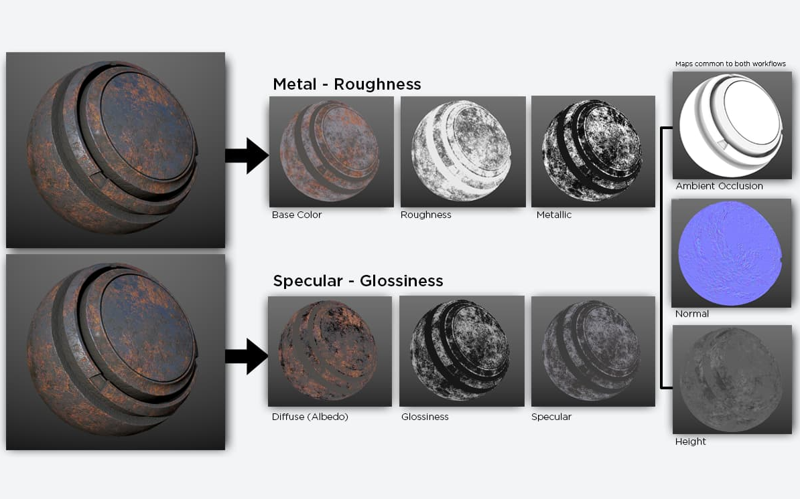
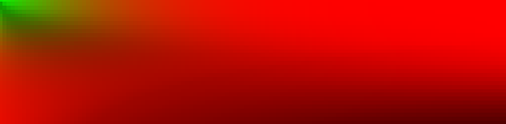
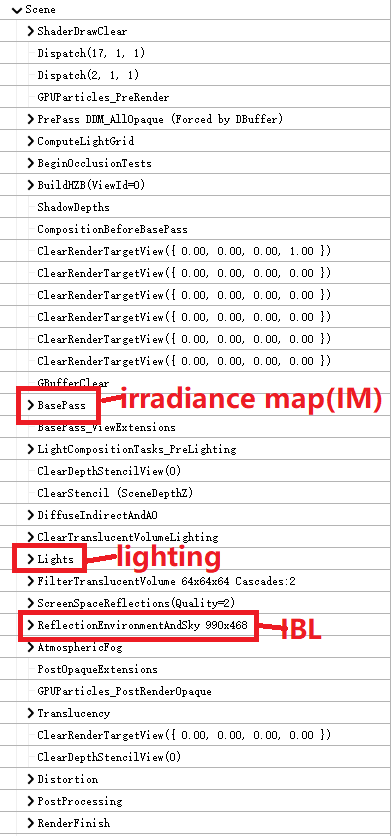
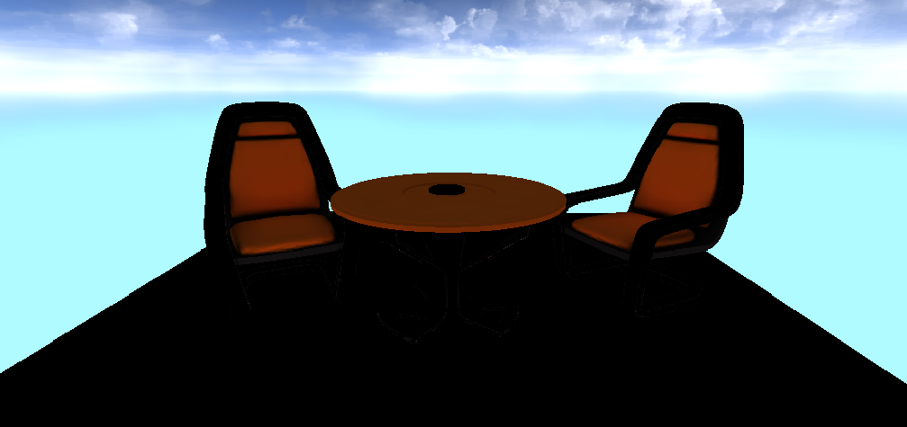
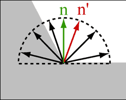
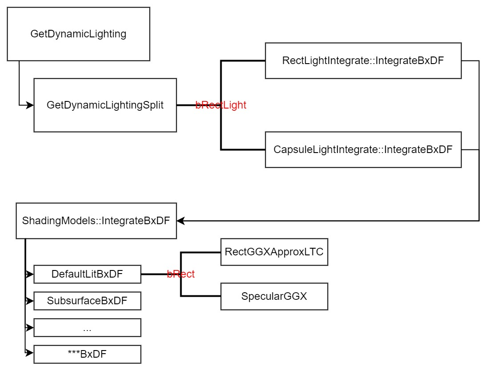
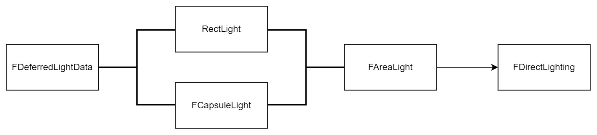
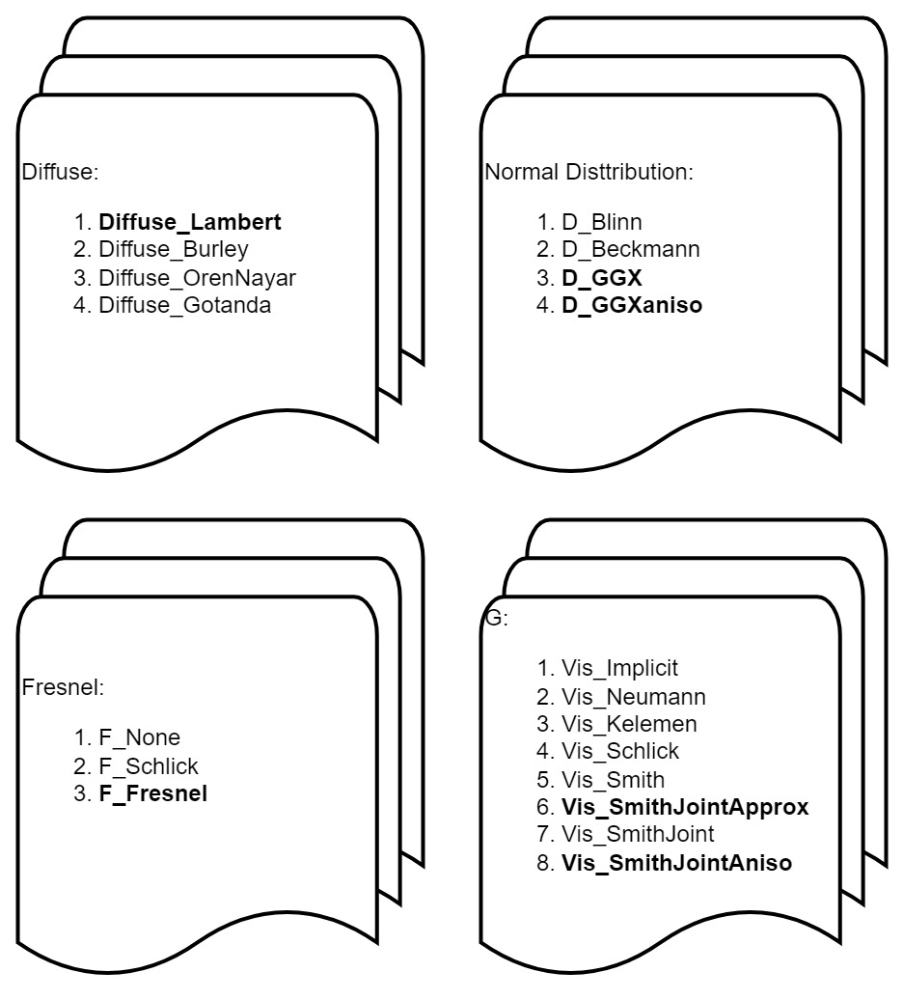
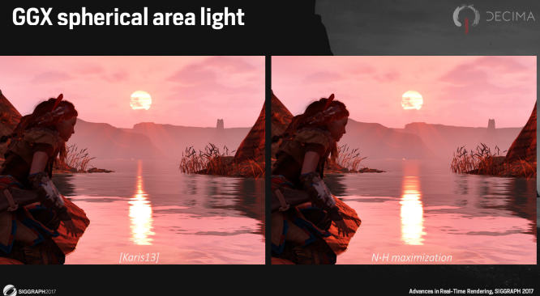
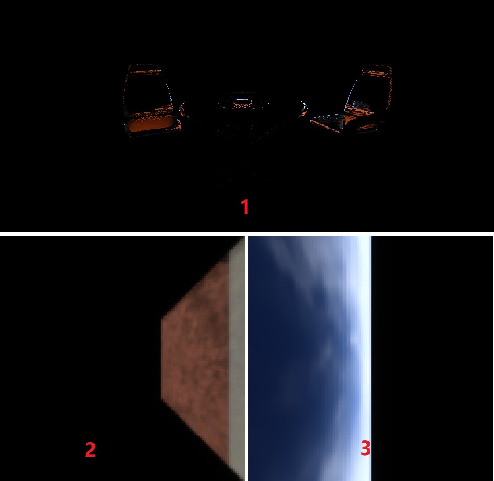

> 喜欢的人他们留在心底 还是依在我身旁 --- 《最好的时光》

在[UE系列](https://mp.weixin.qq.com/mp/appmsgalbum?__biz=MzA5MDcyOTE5Nw==&action=getalbum&album_id=2522976032820346884&scene=173&from_msgid=2650549726&from_itemidx=1&count=3&nolastread=1#wechat_redirect "UE系列")第一篇材质篇中，我们提到了UE的材质定义：Controlling the appearance of surfaces in the world using shaders。

目前，UE中采用的是[PBR材质模型](https://substance3d.adobe.com/tutorials/courses/the-pbr-guide-part-2#:~:text=With%20metal%2Froughness%2C%20the%20base,metal%20has%20no%20diffuse%20color "THE PBR GUIDE")，属于$Metal-Roughness$类型。通常，一个基本的PBR材质核心属性是Base Color（RGB或RGBA），Metallic（float）+ Rougheness（float），Normal Texture（float3），其他属性，比如EMISSIVE，AO，Anisotropy（各向异性）等属性则属于较重要非必须类。UE还提供了一个自己特有的属性Specular，但在默认光照模型下，我并没有发现该属性参与了计算。另外，除了默认光照模型，UE还提供了针对次表面，植物，布料，眼睛等几个着色模型，这些着色模型都是在默认光照模型上追加了一些属性和方法，实现一些具体的效果。

这段时间研究UE的代码，每天总会有很多疑问，期待早日找到问题的解，其实，每个问题都可以有直接的答案，但问题积累之后，如何取舍寻找一个合理的方案，这更能体现一个引擎的设计能力。想起了一句歌词“一万个问题里什么是最简单的回答”，可人生的意义并不是答案，所以我更喜欢这首歌的另一句。



本篇的内容是UE中默认光照模型的PBR实现细节，包括PBR涉及的渲染管线，效果以及性能方面的优化。

## PBR Introduction

基于[PBR材质模型](https://mp.weixin.qq.com/s?__biz=MzA5MDcyOTE5Nw==&mid=2650546280&idx=1&sn=92401b411b99049e99d8682d2efb07cc&chksm=880fbfeabf7836fc6ccec9e73bb7ec2844b53f8a870d0b9d038f5e4eea39decba8c8be701b8c&scene=178&cur_album_id=2518511104424198145#rd "PBR材质模型")，材质的贡献主要有漫反射和镜面反射两种：

$$f_r = f_{diffuse} + f_{specular} = f_{diffuse} + \frac{D \cdot F \cdot G}{4 \cdot (n \cdot l) \cdot (n \cdot v)}(1)$$

这里，$D$是distribution，代表法线的分布；$F$是菲涅尔项，代表光线反射或折射的比例；$G$是Geometry项，代表微表面的可见性。同时，有些$F,D,G$会包含分母中的余弦项，因此实际代码中会约掉分母部分。最终的能量都是来自光照，将所有的光源累加即可：

$$L = \sum{f_r \cdot L \cdot (n \cdot l)}$$

光源来自两处，一个是具体的光源，比如灯泡，直接套用上面的公式累加；而另一个是环境光，比如天空盒，环境光的贡献基于**预计算**技术。环境光的贡献同样分为漫反射和镜面反射，漫反射的贡献基于[irradiance map（IM）](https://graphics.stanford.edu/papers/envmap/envmap.pdf "irradiance map")，神奇的球谐函数将环境光贴图变成了$N$个```vec3```参数，再传入当前的法线方向，就可以得到环境光的漫反射贡献（通常$N=9$）：

```C++
vec3 sphericalHarmonics(vec3 normal, vec3 coefficients[9])
```


而镜面反射基于[Image based Light（IBL）](https://cdn2.unrealengine.com/Resources/files/2013SiggraphPresentationsNotes-26915738.pdf "Real Shading in Unreal Engine 4")，基于LUT表格（Look up Table），通过参数```Roughness```和$NoV$获取环境光的镜面反射贡献:

```C++
// brdfLUT：预计算生成的纹理
// SpecularColor：材质对应的SpecularColor
half3 EnvBRDF( half3 SpecularColor, half Roughness, half NoV )
{
    // brdfLUT是固定纹理
    float2 AB = texture2D(brdfLUT, vec2(NoV, Roughness)).rg;
    float3 GF = SpecularColor * AB.x + AB.y;
    return GF;
}
```

因此，在PBR材质着色器中，贡献来自三处（Lighting，IM，IBL）：

1. Lighting：遍历光源，累加漫反射和镜面反射的贡献
2. 环境光贴图
    - IM（irradiance map）：irradiance的漫反射贡献
    - IBL（image-based light）：radiance的镜面反射贡献

## UE's PBR



上图是UE的[延迟渲染管线](https://mp.weixin.qq.com/s?__biz=MzA5MDcyOTE5Nw==&mid=2650549726&idx=1&sn=29182f188c27de328538b4315914e329&chksm=880fb25cbf783b4a93a22ca4d44e8103e7bd2a95e5489413f1f0690694cc520c99d7c4431511&token=883092547&lang=zh_CN#rd "UE(3)：延迟渲染管线")，上图分别标识了三个贡献对应的Pass，我们依次介绍各自的实现思路以及UE的优化细节。

### Base Pass



上篇介绍，Base Pass采用的着色器脚本是```BasePassPixelShader```,生成了一些GBuffer，其中一个Buffer就是```SceneColorDeferred```纹理（上图），具体实现是```GetPrecomputedIndirectLightingAndSkyLight```函数，该函数考虑了间接光和天空盒（环境光）的漫反射贡献（Diffuse Color），（非lightmap）实现思路都是基于球谐函数，考虑了不同光源（体积光，点光源，Lightamap）对应的漫反射贡献，且支持动态光源；在```GetSkyLighting```方法计算环境光对应的贡献时。

#### 优化



该函数对法线进行了优化，如果开启了```BentNormal```，则会用```BentNormal```取代```Normal```，上图是Bent Normal的示意，不仅考虑当前点的法线方向（绿），同时也考虑周边遮盖关系做调整（红）。UE中可以在蓝图中增加```BentNormal```材质属性，从而开启该功能，解决lightmap中的漏光（light leaking）以及优化AO。更进一步，```BentNormal```还能帮助我们计算```SkyVisibility```的取值：```BentNormal```的平均值的长度来作为AO的可见性。试想一下，在平面法线平行，单位法线累加后的平均长度依然是1，平面也没有遮盖；而在崎岖下，向量累加后的长度会变小，而被遮盖的区域也增多，符合预期。

漫反射中支持[```AOMultiBounce```](https://www.activision.com/cdn/research/Practical_Real_Time_Strategies_for_Accurate_Indirect_Occlusion_NEW%20VERSION_COLOR.pdf "Practical Realtime Strategies for Accurate Indirect Occlusion")。 同时，也考虑了几何形状（Curvature）对Roughness的影响，curvature，normal distribution以及roughness是紧密关联的。最后就是比较常用的Lightmap，这块的原理和具体算法我还不了解，UE提供了CPU和GPU预计算的能力，有不少应用技巧可以优化lightmap以及避免light leaking问题。

### Lights

Light Pass逻辑就是遍历所有的光源$L$，累计光源$L$和BxDF材质$f_r$的（乘积）贡献，这个遍历是在C++层，而计算贡献的代码则由着色器实现，大概的流程如下：



该流程的解释：静态光和环境光处理方式一样，都通过预计算在Base Pass中保存在```SceneColorDeferred```，而具体的光源则定义为动态光源；和静态光的贡献来源一样，动态光源的贡献也被分为（Split）Diffuse和Specular；在着色器中，会根据光源是否为矩形（bRectLight）调用不同的```IntegrateBxDF```;无论是否为矩形，任何光源都是有面积的，封装为```AreaLight```后，调用基类的```IntegrateBxDF```方法；根据不同的着色模型，调用不同的```BxDF```方法；对矩形（bRect）光源有单独的处理方式，其他情况则调用```SpecularGGX```方法。



上图是光源在整个流程中的封装情况，在应用层，无论是点光源，方向光等不同类型，在传入着色器时，都封装为```FDeferredLightData```对象；着色器中会根据不同形状计算光的衰减（Falloff），最终封装为```AreaLight```，方便后面的运算；这些光源最终的贡献则封装在```FDirectLighting```对象中，包括Diffuse，Specular和Transmission三种类型。



以默认光照```DefaultLitBxDF```为例，会调用```SpecularGGX```计算贡献值，该方法对应文章开头的公式（1）。需要$f_{diffuse}，f_{specular}$函数的实现，而$f_{specular}$又包括$F，D，G$三项，```BRDF.ush```文件中可以找到这些方法，UE提供了不同的函数实现，如上图，粗体对应UE的默认方法（个人感觉UE没有提供接口来设置使用不同的方法，这部分需要自己来改动）。

#### 优化



在光源的优化上，除了针对不同情况计算Falloff之外，UE不再认为光源是一个抽象的点，采用[GGX spherical area light](http://advances.realtimerendering.com/s2017/DecimaSiggraph2017.pdf "GGX spherical area light")支持面积光（```SphereMaxNoH```方法，上图是效果对比）。其次，UE针对矩阵形状的光源[矩阵形状的光源](https://blog.unity.com/technology/real-time-polygonal-light-shading-with-linearly-transformed-cosines "Real-Time Polygonal-Light Shading with Linearly Transformed Cosines")单独处理，优化性能。最后，提供了```EnergyNormalization```考虑Specular下面积光的能量守恒。

另外，针对Anisotropy[矩阵形状的光源](http://aconty.com/pdf/s2017_pbs_imageworks_slides.pdf "Real-Time Polygonal-Light Shading with Linearly Transformed Cosines")情况，支持在tangent和bitangent两个方向上不同的roughness，也算是能量守恒方面的改善。

最后是着色模型```ShadingModel```方面，基于我个人的理解分为三大类：

- ClearCoatBxDF&ClothBxDF
    - 前者模拟清漆，后者模拟布料，这两个模型都有比较规范的标准：[clearcoat](https://github.com/KhronosGroup/glTF/blob/main/extensions/2.0/Khronos/KHR_materials_clearcoat/README.md "KHR_materials_clearcoat")，[sheen](https://github.com/KhronosGroup/glTF/blob/main/extensions/2.0/Khronos/KHR_materials_sheen/README.md "KHR_materials_sheen")
- SubsurfaceBxDF&PreintegratedSkinBxDF&SubsurfaceProfileBxDF
    - 模拟次表面的效果，比如次表面散射，多用于皮肤等材质
    - 这部分我之前没怎么了解，总感觉有点玄学，靠经验函数凑效果
    - 着色器对应的代码并不复杂，最终都调用了```DefaultLitBxDF```
- SHADINGMODELID_TWOSIDED_FOLIAGE&HairBxDF&EyeBxDF
    - 针对植物，头发，眼睛的特殊处理
    - 植物模式下提出Wrapped Diffuse概念，对应Transmission贡献
    - 眼睛中增加了Iris相关属性，看上去是模拟光蚀的效果，对应Transmission贡献
    - 头发代码太多，放弃

### ReflectionEnvironment



最后的贡献来自环境光的镜面反射。同样，UE提供了```EnvBRDF```方法，已知```Roughness```和```NoV```，可以获取材质的SpecularColor的贡献；不同的是UE中光源Radiance来自三张纹理（上图），依次为：

1. Screen Space Reflection（SSR 实时）
2. Reflection Environment（预计算）
3. Skylight（预计算）

#### 优化

因为radiance有三处来源，因此需要考虑radiance的叠加效果（纹理Alpha位），另外，UE也考虑了Specular Occlusion的优化，一个是来自DFAO的```GetDistanceFieldAOSpecularOcclusion```，作用于Environment和Skylight的radiance，另一个是```GetSpecularOcclusion```，当开启```BLEND```时，用于radiance之间的叠加。

另外几个小区别是：环境光的镜面反射也支持ClearCoat；在计算纹理的MipMap时，采用的是对数而不是线性的```ComputeReflectionCaptureMipFromRoughness```；```EnvBRDF```方法提供了四个变体，优化不同平台（移动）下的性能。

### 总结

本文从光源贡献的角度，介绍了UE PBR材质在延迟渲染管线下的实现内容。

首先，因为延迟渲染，以及光源来自不同阶段，因此UE的PBR材质涉及了三个Pass，分别是Base，Lights以及ReflectionEnvironment。

另外，在效果优化方面，UE也做了大量优化，将很多研究技术整合在自己的PBR材质实现中，比如面积光源的支持，Curvature，Bent Normal等因素改善AO，以及镜面反射的能量守恒等，还有多种着色模式的提供。

最后，UE在性能优化上也提供了不同的函数实现，方便用户的扩展，以及不同平台的宏定义实现。

总结完UE的PBR实现后，我愿称UE才是真正的缝合怪**Orz**。