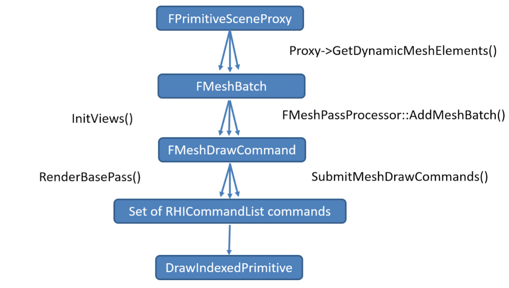

> 如果你在前方回头 而我亦回头，我们就错过 --- 《艳火》

前两篇分别介绍了[UE(1)：材质系统](https://mp.weixin.qq.com/s?__biz=MzA5MDcyOTE5Nw==&mid=2650549692&idx=1&sn=d23db44e95de518437a4f90dff057baf&chksm=880fb23ebf783b2860456c2dd3104236d47b0ecf562a058f4f75096f12580291a77b24b35626&scene=126&&sessionid=1660465578#rd)和[UE(2)：材质着色器](https://mp.weixin.qq.com/s?__biz=MzA5MDcyOTE5Nw==&mid=2650549710&idx=1&sn=9295cf52830393c95c01938d64133a0f&chksm=880fb24cbf783b5a96d1f15940a5b5b988a184d594d911dd7f3f991c94f01fe5e1339965d44a&token=560827638&lang=zh_CN#rd)，主要侧重如何生成材质，本篇的主题是延迟渲染管线（Deferred Shading Pipeline），涉及的是如何通过着色器使用材质，我愿称它为最长的一帧。

延迟渲染管线可以认为是一个Multi-Pass策略，该策略本质就是一个分支：不同Pass之间传递的规范，实现Pass的解耦，这样，每一个Pass只需要完成自己的子任务，按照规范交付结果。在UE中，延迟渲染管线类似两个```for```循环，外层循环对应延迟渲染管线的多Pass的逻辑，称为**Deferred Shading Pipeline**，内层则是每个子任务具体的内容，子任务大同小异，每个子任务对应了一个**Mesh Drawing Pipeline**。

调试UE中，Pass之间紧密连接又互不干涉，那么近又那么远，所以有了这句歌词，莫名的一种失落。

## Mesh Drawing Pipeline



上图是每个子任务对应的Mesh Drawing Pipeline：

- ```FPrimitiveSceneProxy```：对应场景中的几何对象（Mesh）
- ```FMeshBatch```：一批几何对象（Mesh Element），都具有相同的材质```FMaterialRenderProxy```和顶点缓冲区```FVertexFactory```
- ```FMeshDrawCommand```：一个几何对象的完整通道，包括几何信息，着色器等
- ```RHICommandList```：将FMeshDrawCommand转为当前硬件下支持的渲染指令

下面，我们介绍上面这个流程的主要设计框架和要点。

### Primitive2MeshBatch


如上图，在渲染函数```Render```中先进行可见性判断，然后将需要渲染的几何对象，通过```GatherDynamicMeshElements```方法转为```FMeshBatch```对象并添加到```Collector```容器中。这里，Proxy的基类是```FPrimitiveSceneProxy```,每个Proxy中会遍历```LOD```所有的子模型，这个流程下来，一个Proxy可能对应多个```FMeshBatch```，而一个```FMeshBatch```对应一个```FMeshBatchElement```。最后一步，因为是Multi-Pass，用一个PassMask标识每个```FMeshBatch```需要参与的Pass。

### MeshBatch2DrawCommand


此刻，```View.DynamicMeshElements```中保存了参与渲染的```FMeshBatch```对象，因为延迟渲染是Multi-Pass，所以在```SetupMeshPass```中遍历所有的Pass，针对不同的Pass，创建其所需要的DrawCommand，而所有的DrawCommand在```InitViews```中一次性全部创建，虚线表示下面采用多线程机制。

UE中提供了```FMeshPassProcessor```基类，负责将```FMeshBatch```创建成```FMeshDrawCommand```，同样，不同的Pass会继承该类，实现不同的封装方法，比如BasePass提供了```FBasePassMeshProcessor```。

最终，所有的DrawCommand保存在```FMeshPassProcessor```的```DrawListContext```成员中。

### DrawCommand2RHICommand


```FMeshDrawCommand```本身是跟平台无关的，最后一步就是针对当前设备的硬件情况完成最终的渲染过程，如上图所示，因为是Windows平台，所以此处是D3D11。这里，我们是以BasePass为例的流程，其他的Pass，比如PrePass，lighting等也都是基于```FParallelMeshDrawCommandPass```的规范实现。

另外，这里并不是直接执行具体的渲染函数，比如绑定globe shader，index buffer等，而是将指令保存在```FRHICommandList& RHICmdList```队列中，最后统一执行该队列。

### Cached Mesh Draw Commands


上面是一个Mesh Drawing Pipeline的最基本的逻辑和流程，而针对静态网格```Static Mesh```,UE做了优化，缓存了图中蓝线的部分，直接执行最后的RHI渲染指令。

Mesh Drawing Pipeline描述了场景中的Geometry，如何基于```LOD```属性，转换为```FMeshBatch```,再根据Pass的不同，转换为```FMeshDrawCommand```,最终根据硬件的不同，生成对应的```FRHICommandList```的流程，**核心价值**是把面向用户的几何对象转换为面向机器的几何对象，同时要求满足性能和通用性，通用性则是支持在不同Pass中加载不同的shader，实现各自的目的。

## Deferred Shading Pipeline

 Multi-Pass可以理解成游戏里合成装备的过程，一个Pass需要基于当前装备的等级（前一个Pass的结果），满足一定的条件（Shader中的Uniform变量参数），完成一次升级（Mesh Drawing Pipeline），装备等级+1，进入下一级。多个Pass就是依次执行这个过程，合成满级装备（最终的渲染结果）。

 

 延迟渲染的主要流程如下，对应UE的```FDeferredShadingSceneRenderer::Render```方法，里面的Pass非常多，但关键步骤基本相似，个人理解比较核心的四个阶段：

 - ```InitViews```：准备阶段，数据处理成对应的DrawCommand
 - ```RenderBasePass```：延迟渲染的第一个Pass，生成上图中的GBuffer内容
 - ```RenderLighting```：基于G-Buffer，考虑各类光照和分块策略，获取最终的结果
 - ```PostProcessing```：后处理阶段，比如反走样，屏幕空间反射等效果

 

上图是Renderdoc获取的延迟渲染的完整流程，```InitViews```属于数据处理，因此无法体现在渲染流程中，我们简单介绍一下如下的三个主要Pass，理解UE延迟渲染的最简流程。

### PrePass
```PrePass```在```InitViews```和```RenderBasePass```之间，会生成一张深度图。深度图在渲染中的作用非常大，而且无需Pixel片元阶段，计算成本很小，甚至可以生成一个更高分辨率的深度图，提升渲染质量。


### Base Pass

Base Pass对应的就是```RenderBasePass```，顶点着色器执行```BasePassVertexShader```,像素着色器执行```BasePassPixelShader```两个Shader，最终生成对应的G-Buffer内容。


如上图，生成的Buffer依次为屏幕空间下的：

- Normal（法线）
- Metallic（金属）+ Specular（高光）+ Roughness（粗糙）+ 着色模式
- BaseColor（基色）+ AO（遮盖）
- PrecomputedShadowFactors（阴影）

### Lights


上帝说，要有光，就有了光。我们得到了最终的效果。

## 总结

本文介绍了UE延迟渲染中两个核心的Pipeline，一个是Mesh Drawing，一个是Deferred Shading，主要侧重于渲染中的逻辑流程和关键Pass的生成结果，理解渲染中如何利用材质和着色器的大概步骤。

其中，关键Pass的生成结果主要是由对应的Shader实现的，Shader作为材质的一部分，渲染就和和材质建立了关联，具体的Shader算法，涉及到UE中的PBR相关内容，是下篇内容的重点。

当然，UE的渲染流程细节很多，比如多线程机制，一些辅助的Pass，比如```DiffuseIndirectAndAO```（SSAO），后处理中的```TAA```等等，我了解有限。个人比较感兴趣的是材质相关的内容，比如LightMap，反走样等实现细节，后续根据优先级再做学习总结。

调试代码的过程中，这篇文章[剖析虚幻渲染体系（03）- 渲染机制](https://www.cnblogs.com/timlly/p/14588598.html "剖析虚幻渲染体系（03）- 渲染机制")给我的帮助很大。

此刻，我坐在学校的图书馆上，广播最后一句："goodbye, have a nice evening." 想起了我读硕时学校图书馆闭馆时的广播" we wish you a pleasant evening"，也从侧面体现了两校不同气质。

不管了，节约时间，复制粘贴一把梭，能看到这的绝对不是被我华丽的词藻所吸引的，而是朴实无华的爱。