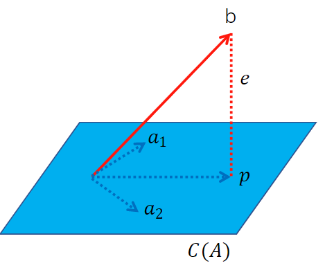

> 我需要一块二向箔，清理用 --- 《三体》

本篇系统介绍了个人对投影的理解，包括投影的数学概念和主要应用，以及如何在频域（傅里叶变换）和球面（球谐）上进行投影的相关内容。最后介绍了UE中球谐函数的实现细节​。

## 投影

写作第一准则，“每增加一条公式便减少一半的读者”。虽然我百般的不舍，但还是得把事情说清楚，只好洒脱的安慰自己，我将失去活成一种获得。



$$Ax = [a_1,a_2] \cdot x = b $$

上图中，向量$a_1$和$a_2$构成蓝色平面，该平面称为A的列空间$C(A)$，显然，向量$b$不在该平面上，因此，$Ax=b$无解。退而求其次，我们在平面上找到向量$p$，保证距离$\left\| e \right\| =\left\| b-p \right\|$最小，我们称向量$p$是向量$b$在列空间$C(A)$上的投影。

平面上任意向量$p$都可以用$A\hat{x}$表达，且向量$e$等于$b-p$。当$e\bot A$时距离最小。可得如下结论，下划线部分就是$A$投影矩阵:

$$A^T(b-A\hat{x})=0\Rightarrow \hat{x}=\left( A^TA \right) ^{-1}A^Tb$$

$$p=A\hat{x}=\underline{A\left( A^TA \right) ^{-1}A^T}b$$

我们不仅可以通过几何关系推导出投影矩阵，也可以通过代数方式求解投影矩阵：平面上的任意一点$p \in A$和向量$p$之间距离的最小值(如下公式)。我们知道极值存在于导数为0的位置，因此对该式求导，令其等于0，可以得到相同的结论。这里省略[推导过程](https://www.cs.uu.nl/docs/vakken/ddm/2019-2020/ "3D Modelling Lecture 5 - Linear Algebra 3")

$$argmin|Ax-b|^2$$

该等式在线性回归中还有另一个名字：最小(argmin)二乘(平方)法（least squares）。如下图，已知三个点$b_1(1,1)$，$b_2(2,2)$，$b_3(3,a)$求一条直线：


$$
\underset{A}{\underbrace{\left[ \begin{matrix}
	1&		1\\
	1&		2\\
	1&		3\\
\end{matrix} \right] }}\underset{x}{\underbrace{\left[ \begin{array}{c}
	C\\
	D\\
\end{array} \right] }}=\underset{b}{\underbrace{\left[ \begin{array}{c}
	1\\
	2\\
	2\\
\end{array} \right] }}
$$

显然，$Ax=b$无解，乘以投影矩阵，在$C(A)$平面找到近似解$\hat{x}$。这里我们定义的是距离上的最小值，如果我们把度量的内容换成角度，则可以建议平面和曲面之间的映射关系：


这样，只需要找到一个合适的目标函数，通过投影矩阵求解该函数的最小值，则可以解决很多现实中的应用，比如下图的地图投影，我们定义的目标函数是在三维空间投影到二维平面时，保持角度不变（conformal）。


## 傅里叶变换


$$
f(t)=\frac{a_0}{2}+\sum_{n=1}^{\infty}{\left[ a_n\cos\mathrm{(}n\omega t)+b_n\sin\mathrm{(}n\omega t) \right]}
$$

上面所采用的投影技术，采用的是一种降维思想，比如把三维空间中的线或曲面，压平到二维平面，降维的同时降低了问题的复杂度，让无解的问题变得有（近似）解。我们摆脱空间的限制，投影在数学上的本质是**两个函数相乘的积分**。比如文章开头的那条线$b$，和平面相乘是一个内积（余弦）操作，而积分的结果是$p$。这样，我们不难理解，傅里叶变换则是将任意一条线投影到一组正弦函数上。上图所示，先看frequency方向的一组正（余）弦函数，频率倍数增长，我们用正（余）弦函数和time轴的红色曲线做内积求和，对应frequency轴上的值，基函数中的每一个正（余）弦函数都做一次内积求和，分别对应参数$a_n$和$b_n$。**内积就是将该曲线投影到正弦函数，获取该频率在时间轴上的积分**。


通常，当我们增加基函数的数量时，基函数的频率会逐步变高，对应的系数$a_i$越来越小，拟合的效果会越来越准确。傅里叶变换实现了空域，时域和频域的相互转换，写到此时，不仅想起了那句“繁星点点，跨越银河能否与你相见”，如果你曾玩过仙剑，你应该能和此刻的我一样感同身受，这或许也算是频域上的一种遇见，而伟大的欧拉又怎能错过这样的一个时刻。

$$
e^{i\varphi}=\cos \varphi +i\sin \varphi 
$$

之前都是针对函数$f(x)$进行傅里叶变换，但现实中，经常是一组离散的数据$x(n)$，这样，积分对应转为求和，内积不变但采用复数形式，可得离散傅里叶的复数形式：

$$
X_k=\sum_{n=0}^{N-1}{x_ne^{\frac{-j2\pi nk}{N}}}
$$

$$
=\sum_{n=0}^{N-1}{x_nw^{nk}}, w=e^{\frac{-j2\pi}{N}}
$$

我们进一步写成离散傅里叶变换的矩阵形式：

$$
\left[ \begin{array}{c}
	X_0\\
	X_1\\
	X_2\\
	\vdots\\
	X_{\begin{array}{c}
	N-1\\
\end{array}}\\
\end{array} \right] =\underset{F}{\underbrace{\left[ \begin{array}{c}
	\begin{matrix}
	1&		1&		1&		\cdots&		1\\
	1&		w&		w^2&		\cdots&		w^{N-1}\\
	1&		w^2&		w^4&		\cdots&		w^{2\left( N-1 \right)}\\
	\vdots&		\vdots&		\vdots&		\cdots&		\vdots\\
	1&		w^{N-1}&		w^{2\left( N-1 \right)}&		\cdots&		w^{\left( N-1 \right) \left( N-1 \right)}\\
\end{matrix}\\
\end{array} \right] }}\left[ \begin{array}{c}
	x_0\\
	x_1\\
	x_2\\
	\vdots\\
	x_{\begin{array}{c}
	N-1\\
\end{array}}\\
\end{array} \right] 
$$

这样，基于矩阵$F$和它的逆矩阵（复数）$F^{-1}=\frac{1}{N}F^{H}$，我们实现了离散数据的傅里叶变换和逆变换（大写$X$和小写$x$的相互转换）。美中不足的是，明明一个对称矩阵，而且列向量相互正交，算法复杂度是$O(N^2)$，你能忍？

$$
\left[ F_N \right] =\left[ \begin{matrix}
	I&		D\\
	I&		-D\\
\end{matrix} \right] \left[ \begin{matrix}
	F_{N/2}&		0\\
	0&		F_{N/2}\\
\end{matrix} \right] \left[ P \right] 
$$

一顿操作后，这个矩阵变成了如上形式，其中$P$是置换矩阵，$D$是对角矩阵，总之算法复杂度变为了$O(nlogn)$，这就是大名鼎鼎的快速傅里叶变换。

同理，我们将傅里叶变换扩展到二维平面$(M,N)$：

$$
F\left( u,v \right) =\sum_{x=0}^{M-1}{\sum_{y=0}^{N-1}{f\left( x,y \right) e^{-j2\pi \left( ux/M+vy/N \right)}}}
$$


点到中心的距离和方向分别代表了频率和平面波方向，而计算过程则和一维傅里叶没有差别。正如之前所说，傅里叶变换实实现了空域，时域和频域的转换，数据有了一种新的表达方式。基于这种方式，可以实现数据的分析，压缩，以及预处理等各类应用。

## 球谐函数

傅里叶变换让我们实现了函数投影到正弦函数（频域）上，那投影在球面上会是什么效果呢？


如上图，和傅里叶变换的思想类似，数学家定义了一组球面上的基函数，每一个基函数$B_{l,m}(\omega)$对应如上$(l,m)$的形状。每一个基函数和一个空间的函数$f(\omega)$内积积分后，获取对应的系数：

$$
c_{l,m}=\int_{\Omega}{f\left( \omega \right) B_{l,m}\left( \omega \right) d\omega}
$$

$$
B_{l,m}(\omega) = y_l^m(\theta,\varphi)
$$

理解过程可以参考傅里叶变换中的基函数，傅里叶中的基函数是正弦函数，而在球谐函数中的基函数是一个$B(\omega)$，而变换对应的计算部分是完全相同的。这里，球谐函数的基函数称为**勒让德多项式**，对球谐函数的理解并不需要理解该公式的内容。同理，这个逆过程实现了函数的还原，基函数越多，还原的准确度越高：


问题来了，数学家是怎么想到的，是先有了形状，还是先有的勒让德多项式。答案要从拉普拉斯方程说起（该部分不感兴趣的可以忽略，并不影响对球谐的理解）。

$$
\nabla ^2f=\frac{\partial ^2f}{\partial x^2}+\frac{\partial ^2f}{\partial y^2}+\frac{\partial ^2f}{\partial z^2}
$$

假设存在一个标量场，每一点对应一个数值，可以代表该点的温度，或者任何物理意义，拉普拉斯方程描述了该点对应梯度的散度。梯度容易理解，就是该点和临近点的变化情况，在三维空间中是一个$(x,y,z)$的向量（下图）。


我们在该点无限小的空间构建一个微表面，散度（Divergence）则描述了在该表面流入和流出的变换情况。


拉普拉斯方程则是先求一个标量场的梯度（向量场），然后求解该梯度的散度。如上图，梯度表达了该点的趋势，而梯度的散度则可以追溯这个趋势的源头（正）和尽头（负）。当拉普拉斯方程的值为零时，则代表了一种状态上的均衡，和谐，这也是Harmonics的由来。

$$
\frac{\partial ^2f}{\partial x^2}=\lim_{a\rightarrow 0} \frac{f\left( x+a \right) -2f\left( x \right) +f\left( x-a \right)}{a^2}
$$

如上是对一个标量场某一点x方向的二阶导的计算方式，y和z方向计算方式相同。当我们求解球面坐标系下的拉普拉斯方程，则得到球面上的谐和函数（Spherical Harmonics）。

下面，我们看一下UE中球谐函数对应的实现。

### TSHVector

UE中的球谐函数封装在```TSHVector```模板类中，支持2阶和3阶，分别对应4个和9个基函数。

```C++
// SHMath.cpp
static int32 InitSHTables()
```

在初始化时，会构建```BasisL```，```BasisM```，```NormalizationConstants```三个全局变量。```BasisL```和```BasisM```对应每一个基函数```BasisIndex```对应的L和M，而```NormalizationConstants```表示标准化因子$K_l^m$($m\ne 0$时还需乘以$\sqrt2$)：

$$
K_{l}^{m}=\sqrt{\frac{\left( 2l+1 \right)}{4\pi}\cdot \frac{\left( l-\left| m \right| \right) !}{\left( l+\left| m \right| \right) !}}
$$

上面的部分是固定不变的，而一组完整的球谐基函数则调用```SHBasisFunction```方法实现，输入参数是世界坐标系下的方向```Vector```，主要方法是```LegendrePolynomial```。

```C++
// SHMath.h
static TSHVector SHBasisFunction(const FVector& Vector)
```

这样，我们获取了一组基函数对象```TSHVector```，对应最终的因子$c_l^m$是积分下的内积，分别对应求和和乘法操作，分别调用如下的方法实现，因为参数是一个颜色，所以最终返回的是```TSHVectorRGB```，包括R，G，B三个分量。


```C++
// SHMath.h
TSHVectorRGB<Order> operator*(const TSHVector<Order>& A,const FLinearColor& B)
TSHVectorRGB operator+(const TSHVectorRGB& A,const TSHVectorRGB& InB)
```

返回的结果TSHVectorRGB，里面存储了一组基函数对应的所有$c_l^m$。

如上就是UE中球谐函数如何变换，生成基函数因子的过程。只要我们理解了球谐的原理，可以发现，UE中关于球谐的实现算法上并不复杂，属于无脑套公式的操作；主要还是在接口封装以及模板设计上的理解。

另外，```ApplyWindowing```方法用于解决球谐函数的振铃效应（ringing artifacts），这个和傅里叶变换中的原因一样，无论是球谐还是傅里叶，缺点就是无法保留高频部分的信息，因此在边界等高频区域，则无法真实还原。但我搜了一遍，该方法尽在Volume中调用。

这里仅介绍了UE中如何创建球谐函数，而如何使用球谐函数，属于lightmap的范畴。

## 总结

本文介绍了我对投影的理解，从基本的投影概念，最小二乘法，然后延伸到频域的傅里叶变换，以及球面的球谐函数。阐述了我对投影，傅里叶变换以及球谐函数的理解。最后给出了UE中球谐函数生成基函数因子的实现方法。似乎，我们还可以投影到导数上，你是否想到了另一位数学家呢？

写到这，突然想起了很久前看的电子书《Heros in my heart》，介绍了很多数学家的故事。借作者的话来做结尾：美丽有两种，一是深刻又动人的方程，一是你泛着倦意淡淡的笑容。


