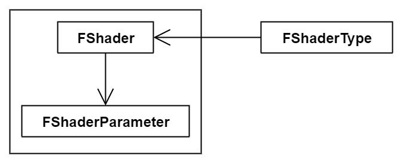
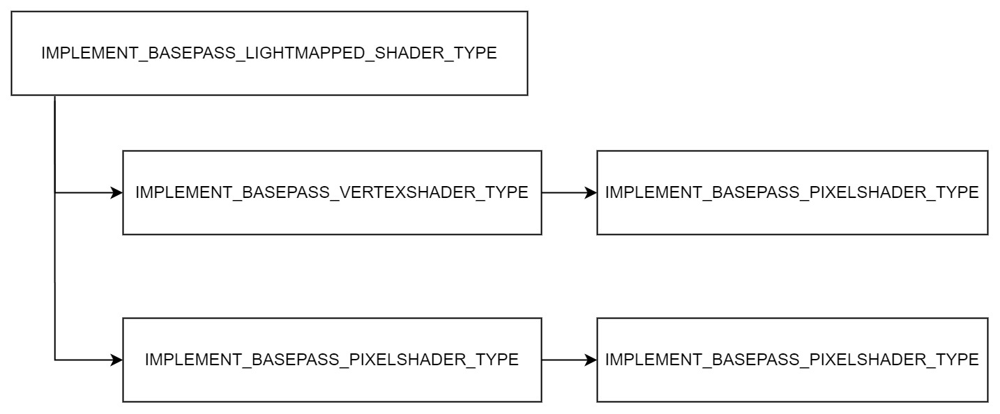
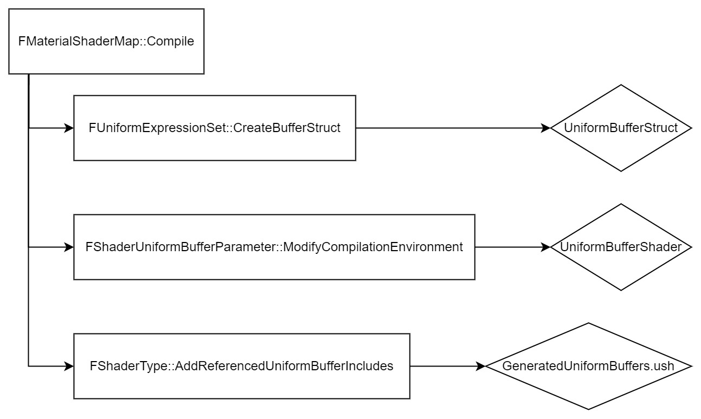
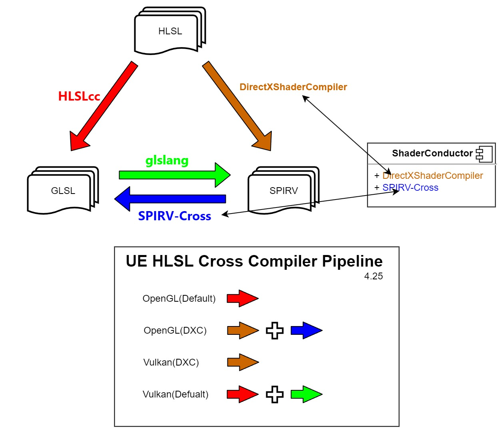

上一篇[UE(1)：材质系统](https://mp.weixin.qq.com/s?__biz=MzA5MDcyOTE5Nw==&mid=2650549692&idx=1&sn=d23db44e95de518437a4f90dff057baf&chksm=880fb23ebf783b2860456c2dd3104236d47b0ecf562a058f4f75096f12580291a77b24b35626&scene=126&&sessionid=1660465578#rd)整体介绍了材质的三要素`UMaterial`，`FMaterial`，`FMaterialRenderProxy`以及相互之间的逻辑关系，未涉及实现细节，比如材质和Shader之间的关联，以及其在渲染管线中的使用方式。在上篇基础上，深入了解Material和Shader之间编译（Complication）相关的内容，形成了这篇学习总结。

## Shader Object



UE的着色器主要有三个类：

- `FShader`
    - 编译后的着色器对象 
- `FShaderParameter`    
    - 着色器中需要绑定的参数
- `FShaderType`
    - 用于序列化，编译以及缓存一个着色器对象

### FShader
UE编译HLSL后会创建一个`FShader`对象，`FShader`是一个基类，主要的两个子类是：

- `FGlobalShader`
    - 全局着色器，共享一个实例，用于渲染固定的几何对象和不需要材质的内容，比如后处理
- `FMaterialShader`
    - 该着色器绑定了一个材质，如果该着色器也绑定了`FVertexFactory`（几何内容，UE的网格类型），则对应`FMeshMaterialShader`，继承自`FMaterialShader`

### FShaderParameter

`FShaderParameter`是着色器对象中对应的参数，主要有：

- `FShaderParameter`:基本的uniform变量，比如float1~4
- `FShaderResourceParameter`：Shader资源，比如纹理，采样
- `FRWShaderParameter`：UAV或SRV资源，具体不懂
- `FShaderUniformBufferParameter`：UniformBuffer变量

`FShaderParameter`中的成员变量有`BufferIndex`,`BaseIndex`,`NumBytes`,标识了该资源在GPU中的入口（索引）和字节数，等同于OpenGL中的`glGetUniformLocation`或DX11中的`GetResourceBindingDesc`。

### FShaderType

`FShader`+ `FShaderParameter`建立了**GPU中的着色器资源以及相关参数的索引**；而一个`FShader`对应一个`FShaderType`，比如$`FMeshMaterialShader`\leftrightarrow `FMeshMaterialShaderType`$，外部通过`FShaderType`管理对应的`FShader`对象，比如`FShaderType`的方法`ConstructCompiledType`实现创建一个`FShader`对象。

材质中引用的着色器对象是`FMeshMaterialShader`,`FShaderUniformBufferParameter`和 `FMeshMaterialShaderType`，下面我们重点介绍这三个类的相关作用。

注：在`FShader`类中，变量使用了`LAYOUT_FIELD`宏封装，属于C++反射系统范畴。

## Shader Permutation

UE中通过预处理的方式来创建着色器代码的特化，HLSL代码中会采用C风格的宏，比如`#if`,`#define` 不同的宏定义会形成不同的逻辑分支，UE会排列组合各种不同的逻辑情况(比如开启环境光或关闭，开启Fog或关闭，这样会有四种逻辑组合)，每种分支对应生成一个shader变体。UE把这个过程描述为Shader Permutation。

```C++
// MaterialShaderType.h
#define IMPLEMENT_MATERIAL_SHADER_TYPE(TemplatePrefix,ShaderClass,SourceFilename,FunctionName,Frequency)
```

上面的宏`IMPLEMENT_MATERIAL_SHADER_TYPE`将一个C++类`ShaderClass`绑定一个HLSL文件`SourceFilename`，函数的入口是`FunctionName`,而`Frequency`标识着色器的类型，比如顶点`SF_Vertex`,片元`SF_Pixel`等，着色器类型对应`EShaderFrequency`枚举。

```C++
// BasePassRendering.cpp
#define IMPLEMENT_BASEPASS_VERTEXSHADER_TYPE(LightMapPolicyType,LightMapPolicyName) \
typedef ... ; \
IMPLEMENT_MATERIAL_SHADER_TYPE() ;
```

接着，对于一个给定的`LightMapPolicyType`和`LightMapPolicyName`，`IMPLEMENT_BASEPASS_VERTEXSHADER_TYPE`则将不同的顶点类（Class）`vertex`,`hull`和`domain`绑定不同的HLSL代码。

```C++
// BasePassRendering.cpp
#define IMPLEMENT_BASEPASS_PIXELSHADER_TYPE
```
采用同样的思路，将片元类绑定对应的HLSL代码

```C++
// BasePassRendering.cpp
#define IMPLEMENT_BASEPASS_LIGHTMAPPED_SHADER_TYPE \
IMPLEMENT_BASEPASS_VERTEXSHADER_TYPE \
IMPLEMENT_BASEPASS_PIXELSHADER_TYPE
```

最后，针对不同的LightMap Policy，`IMPLEMENT_BASEPASS_LIGHTMAPPED_SHADER_TYPE`宏创建了三种不同的顶点类和一种片元类可能的组合对应的Pass。




上图是整体的逻辑关系，`IMPLEMENT_BASEPASS_LIGHTMAPPED_SHADER_TYPE`的价值就是针对不同的LightMap，不同的顶点和片元组合，创建不同的BasePass对象，每个对象通过类方法`ModifyCompilationEnvironment`确定该组合下，HLSL中各种环境变量值。该实现方式基于C++ Template的能力，因此做到了在材质编辑阶段执行，并缓存到`Shader Map`。好处是该阶段属于GPU code的**编译期**，host code(C++)的**运行时**，保证了性能；缺点是可怕的脚本编译时间，一个材质资产需要考虑各种组合的逻辑分支，增加的编译的计算量。

注：Base Pass是UE中渲染管线的概念，对应延迟渲染中的第一个Pass。编译期是将HLSL编译成bytecode，DXC（DX11）格式

这种设计的另一个缺点是C++和GPU code分离，同一个参数需要针对C++和GPU分别提供两个变量，增加了代码的复杂度，用过CUDA的人应该能够理解[unified shader](https://dl.acm.org/doi/10.1145/3543866 "unified shader")的设计思想，如何保证host和GPU代码混写，这也是一种解决方案。

## UniformBuffer

Shader中除了不同逻辑下对应的函数，另一个主角就是Uniform参数，该参数需要实现：
- Create - 创建该UniformBuffer资源（编译中）
- Binding - 将该资源和着色器中的参数索引绑定（编译后）
- Update - 更新该资源（渲染阶段）

一个UniformBuffer对应一个C++的结构体：

```C++
#ifndef __UniformBuffer_Material_Definition__
#define __UniformBuffer_Material_Definition__
cbuffer Material
{
    half4 Material_VectorExpressions[2];
    half4 Material_ScalarExpressions[1];
} Material = {Material_VectorExpressions,Material_ScalarExpressions,};
#endif
```



如上图，分别对应三步：
- 在`CreateBufferStruct`中创建UniformBuffer结构体
- 根据这个结构体，在`ModifyCompilationEnvironment`中将结构体对应的字符串插入到HLSL代码片段中
- 最终完整的HLSL代码iniclude所有的UniformBuffer文件（ush），进入编译阶段

HLSL代码的编译是通过`CompileShader`方法（ShaderFormatD3D.cpp），里面主要有两个函数：

- D3DCompileFunc：编译HLSL代码
- D3DReflectFunc：获取着色器中Uniform变量对应的索引

上篇介绍了编译HLSL的流程，编译成功后，会执行`ExtractParameterMapFromD3DShader`方法，该方法会调用D3DReflectFunc，将返回的结果（索引值）保存到`FShaderCompilerOutput:FShaderParameterMap`结构体中，而编译后的返回值是一个`FShaderCompilerOutput`对象。

编译结束后，会触发`FMaterialShaderMap::ProcessCompilationResultsForSingleJob`，这里，会根据`FShaderCompilerOutput`内容创建对应的`FMeshMaterialShader`对象，而对象中UniformBufer的索引值`BaseIndex`对应该变量在着色器中的位置。

我们在编译阶段完成了Create和Binding，在渲染线程中则需要对该变量的更新，这分为两步，先在CPU内存中更新内存块，然后将内存上传到GPU对应的Uniform Buffer（DX11中的ConstantBuffer）。上篇中我们提到，在`FMaterialRenderProxy::EvaluateUniformExpressions`中实现了Update：
- `FUniformExpressionSet::FillUniformBuffer`：将材质中的Uniform值写入到`TempBuffer`指针对应的CPU内存；
- 如果GPU中还没有创建该变量，则调用`RHICreateUniformBuffer`,创建对应的GPU资源；
- 然后调用`RHIUpdateUniformBuffer`将CPU内存拷贝到GPU上。

这样，`FMaterialShaderMap::Compile`编译阶段创建了`UniformBuffer`对应的HLSL代码片段，`FMaterialShaderMap::ProcessCompilationResultsForSingleJob`编译完成后创建了`UniformBuffer`的GPU资源，以及和着色器中的索引映射，`FMaterialRenderProxy::EvaluateUniformExpressions`渲染阶段则会判断该变量在host端是否变化，如果变化，则更新到GPU端。

## HLSL Cross Compiler

Pixar在1988年5月发布的RenderMan接口规范3.0版中向公众介绍了['Shader'](https://en.wikipedia.org/wiki/Shader "Shader wiki")这词。UE的shader是基于HLSL语法，但UE本身是跨平台的，因此，需要实现HLSL生成其他平台对应着色器的能力。



这里，主要给出了OpenGL系列和Vulkan平台对应的流程。UE主要依赖`ShaderConductor`，`HLSLcc`和`glslang`。在HLSLcc中，使用了Mesa's IR解析HLSL的Abstract Syntax Tree(AST)并优化。

## 总结

本篇是上一篇材质的延续，涉及到材质Shader编译中的具体技术细节，包括shader permutation的设计实现，uniform buffer的实现以及对应的DX11接口，最后是UE跨平台编译HLSL的Pipeline。

突然觉得，OpenGL的时代已经过去了，为什么DX11之后可以是DX12，为什么OpenGL之后只能是Vulkan。想得却不可得，你奈人生何。